# Webサービス設計における「考慮漏れ」をなくすための教科書

## 副題：壊れ方から逆算する、実務で通用する設計レビューの思考法

この文書は、Webサービス設計で起きる「考慮漏れ」を、単なるチェックリストではなく、設計者の思考方法として体系化するための教科書です。

対象は、要件定義、基本設計、詳細設計、API設計、DB設計、レビュー、テスト設計、運用設計に関わる人です。実装者だけでなく、プロダクトマネージャー、QA、SRE、カスタマーサポート、業務設計者にも役立つように書いています。

この文書で扱う「考慮漏れ」とは、単に「ケースを忘れた」という軽い話ではありません。考慮漏れとは、ある設計が前提としている世界と、実際にシステムが置かれる世界の差分を見落とすことです。

たとえば、設計者は「ユーザーが注文ボタンを1回押す」と考える。しかし現実には、ユーザーは二重クリックする。ブラウザは再送する。APIはタイムアウトする。決済事業者は成功したのに自社DBへの保存が失敗する。Webhookは重複する。運用担当者は夜間に手動復旧する。キャンセル要求は決済確定直後に来る。ユーザーの電話番号は変わる。仕様変更で、かつて「顧客の識別子」だった値が、単なる連絡先属性へ変わる。

この差分を見落とすと、設計は一見動きます。しかし、動いているように見えるだけです。負荷が上がる、連携先が遅れる、仕様が増える、人間が運用に入る、データが長期間蓄積される、こうした未来が来た瞬間に破綻します。

この教科書の中心テーマは、次の一文です。

> 強い設計とは、「正常に動く道」を描くことではなく、「壊れてはいけない条件」を明示し、壊れ方を制御できる形にすることである。

---

## 目次

- 第1章 なぜ設計考慮漏れが発生するのか
- 第2章 強い設計者の思考順序
- 第3章 業務ルール設計
- 第4章 状態設計
- 第5章 データ設計
- 第6章 API設計
- 第7章 外部連携
- 第8章 並行処理
- 第9章 異常系設計
- 第10章 禁止系設計
- 第11章 影響範囲分析
- 第12章 認知負荷と設計
- 第13章 シーケンス図
- 第14章 テスト観点
- 第15章 運用設計
- 第16章 過剰設計との境界
- 終章 設計レビューで使う統合チェックリスト
- 付録1 設計レビュー用テンプレート
- 付録2 よくある危険な言葉
- 付録3 最後に覚えておくべき原則

## 全体マップ

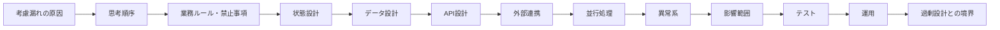

本書は、最初から順に読むことも、設計レビュー時に該当章を参照することも想定しています。NotebookLMなどで音声化する場合は、章ごとに区切って聴くと、各観点の「なぜ」を反復しやすくなります。

---

## この教科書の読み方

各章では、次の構造をできるだけ守ります。

1. なぜその観点が重要なのか
2. 弱い設計者がどう考えがちか
3. 強い設計者がどう考えるか
4. 悪い例
5. 良い例
6. 悪い例がどう壊れるか
7. 将来どのように破綻するか
8. レビューで確認すべき問い

この文書の例では、主に「注文」「決済」「通知」「外部決済サービス」「会員情報」を題材にします。理由は、これらがWebサービス設計における典型的な事故領域を含むからです。注文は状態を持ち、決済は不可逆操作を含み、通知は失敗しやすく、外部連携は遅延し、会員情報は変化し、運用復旧が必要になります。

---

# 第1章 なぜ設計考慮漏れが発生するのか

## 1.1 考慮漏れは「知識不足」だけではない

考慮漏れは、単に経験が浅いから発生するわけではありません。経験者でも漏らします。むしろ実務では、知識のある人ほど「これは当然わかっている」と思い込み、明文化しないことで漏れを生むことがあります。

考慮漏れの本質は、人間の認知能力、組織の圧力、仕様の曖昧さ、時間の制約、実装の誘惑が重なった結果です。

設計者の頭の中には、画面、API、DB、ユーザー操作、業務ルール、外部連携、エラー、運用、テスト、将来変更といった多くの要素が同時に存在します。これらを頭の中だけで保持しようとすると、ワーキングメモリが飽和します。すると人間は無意識に単純化します。

その単純化の典型が、「まず正常系を考える」です。

正常系から考えること自体は悪くありません。問題は、正常系を「世界の代表」だと思ってしまうことです。実際のWebサービスは、正常系よりも、境界、遅延、失敗、重複、変更、権限、過去データ、運用復旧で壊れます。

## 1.2 人間はなぜ漏らすのか

人間は、連続した物語として物事を理解するのが得意です。

「ユーザーが商品を選ぶ。注文する。決済する。注文完了メールが届く。」

このようなストーリーは理解しやすいです。しかし、システム設計で重要なのは、ストーリーから外れた瞬間です。

「決済は成功したが、注文作成が失敗したらどうなるか」
「注文完了メールだけ失敗したら、注文は完了なのか」
「決済完了Webhookが2回来たらどうなるか」
「ユーザーが注文直後にキャンセルしたら、決済取消と発送停止の順序はどうなるか」
「管理者が手動で状態を変更した場合、監査ログは残るか」

これらは物語として気持ちよく流れません。だから人間の頭は避けたがります。

設計レビューで考慮漏れを見つけるには、気持ちよい業務ストーリーを一度壊す必要があります。強い設計者は、あえて物語を分断します。

- その操作の前に、状態は何だったのか
- その操作の後に、どの不変条件が守られているべきか
- 途中で止まったら、どの事実だけが残るのか
- 同じイベントが2回来たら、2回目は何をすべきか
- 外部だけ成功したら、内部はどう復旧するのか
- 内部だけ成功したら、外部はどう整合するのか

これは、自然な思考ではありません。訓練された思考です。

## 1.3 実務ではなぜ漏れやすいのか

実務では、考慮漏れを誘発する力が常に働きます。

第一に、納期があります。納期が近いと、チームは「まず動くもの」を求めます。動くものを作るには、正常系を実装するのが最短です。異常系、運用、履歴、監査、権限、並行処理は、動くデモでは目立ちません。だから後回しになります。

第二に、仕様が断片化されています。プロダクトマネージャーは業務価値を語り、デザイナーは画面を語り、エンジニアはAPIを語り、QAはテスト観点を語り、CSは問い合わせを語ります。しかし「この状態でこの権限の人がこの操作をし、外部連携が途中で失敗した場合」という横断的な問いは、誰の担当でもないことがあります。

第三に、設計書が画面中心になりがちです。画面は見えるため議論しやすい。一方、状態、不変条件、禁止遷移、履歴、再実行、手動復旧は見えにくい。見えないものはレビューで落ちやすい。

第四に、実装中に考えればよいという誤解があります。実装しながら考えると、局所的な都合が勝ちます。「このif文を足せば通る」「このカラムを追加すれば保存できる」「このAPIを叩けば画面は動く」。しかし、局所的に動くものを積み重ねても、全体として整合した設計になるとは限りません。

## 1.4 認知負荷と考慮漏れ

認知負荷とは、ある作業を行うときに脳が同時に処理しなければならない情報量です。

Webサービス設計の認知負荷は高いです。たとえば「注文確定」を設計するとき、同時に以下を考える必要があります。

- ユーザーはログイン済みか
- カート内容は最新か
- 在庫は残っているか
- 価格は注文時点で固定するか
- クーポンは利用済みにするか
- 決済はいつ確定するか
- 決済が失敗したら在庫引当を戻すか
- 注文番号はいつ発行するか
- メール通知が失敗したら注文はどうなるか
- 管理画面にはどの状態で表示するか
- 二重クリックで注文が2件作られないか
- Webhookが遅れて来たらどうするか
- バッチ再実行で重複しないか
- 監査ログは残るか
- 復旧手順はあるか

これを頭の中だけで保持するのは困難です。したがって、強い設計者は考える能力が高いというより、考える対象を外部化するのが上手い人です。

状態遷移図、ER図、シーケンス図、状態遷移表、禁止事項リスト、異常系マトリクス、TODO、未決事項、テスト観点表。これらは単なるドキュメントではありません。思考の外部メモリです。

設計書の価値は、完成した文書そのものよりも、考えるべき対象を紙面上に固定し、チーム全員で同じ漏れを見られるようにすることにあります。

## 1.5 実装しながら考えると漏れる理由

実装は、具体的すぎます。

コードを書いていると、目の前の関数、型、テーブル、APIレスポンス、テストケースに意識が集中します。これは必要な集中ですが、同時に危険でもあります。

たとえば、注文APIを実装しているとします。

```text
POST /orders
```

実装者は、リクエストを受け取り、DBに注文を保存し、決済APIを呼び、メールを送る処理を書きます。このとき、頭の中では処理順序が一本道になりがちです。

```text
注文作成 → 決済 → メール送信 → 完了
```

しかし、設計で見るべきなのは一本道ではなく、分岐と中断です。

```text
注文作成成功 → 決済失敗
注文作成成功 → 決済成功 → メール失敗
決済成功 → DB更新失敗
同じ注文リクエストが2回来る
決済Webhookが先に来る
キャンセルと決済確定が同時に来る
```

コードを書きながらこれを全部考えるのは難しいです。なぜなら、実装中の脳は「今この処理を完成させる」モードになっているからです。

強い設計者は、実装前に一度、コードから離れます。そして「この世界で起きてはいけないことは何か」を洗い出します。

## 1.6 悪い考え方と良い考え方

### 悪い例：画面の操作順だけで設計する

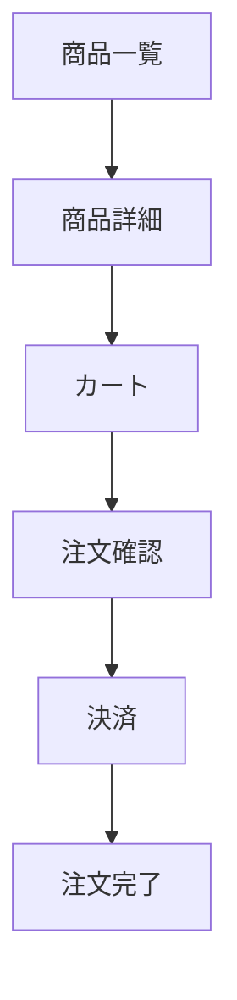

この図は、ユーザー体験の説明としては悪くありません。しかし、設計レビューの主役にすると危険です。

なぜ危険か。状態が見えないからです。在庫引当がどこで起きるか、注文番号がいつ発行されるか、決済成功と注文完了の関係、メール失敗時の扱い、キャンセル可能な範囲、権限、外部連携失敗が見えません。

この図だけで設計を進めると、「ユーザーはこの順に進む」という前提に依存します。しかし現実には、戻るボタン、リロード、二重送信、セッション切れ、価格変更、在庫切れ、決済遅延が発生します。画面遷移図は、ユーザーが何を見るかを説明できますが、システムが何を保証するかは説明できません。

### 良い例：状態・事実・禁止条件を先に置く

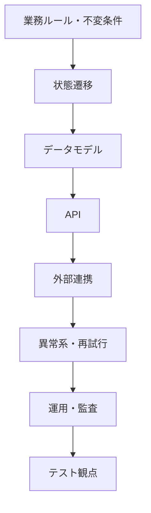

良い設計は、画面からではなく、守るべき世界から始まります。

「注文は、支払い確定前に発送されてはならない」
「同じ決済成功イベントで売上が二重計上されてはならない」
「キャンセル済み注文は発送指示に進んではならない」
「ユーザーの電話番号変更によって過去注文の連絡先履歴が改ざんされてはならない」

このような不変条件を先に置くと、状態、データ、API、外部連携、テストのすべてが、それを守るための手段になります。

## 1.7 第1章のレビュー問い

設計レビューでは、次の問いを使います。

- この設計は、正常系の物語だけを説明していないか
- 途中で止まった場合、どの事実が残るか
- 二重実行された場合、何が二重になるか
- 外部連携先だけ成功した場合、どう復旧するか
- 状態の変化は明示されているか
- 禁止されるべき遷移は書かれているか
- 「壊してはいけない条件」は要件として明文化されているか
- 設計書は、思考の外部メモリとして機能しているか

---

# 第2章 強い設計者の思考順序

## 2.1 なぜ思考順序が重要なのか

設計では、何を考えるかだけでなく、どの順番で考えるかが重要です。

順番を間違えると、後から大きな手戻りが発生します。たとえば、APIから考え始めると、`POST /orders` や `PUT /orders/{id}` のようなエンドポイントはすぐに決められます。しかし、その前に「注文とは何か」「注文はどの状態を持つか」「いつキャンセル可能か」「決済成功と注文完了は同じ意味か」を決めていなければ、APIは業務の意味を正しく表現できません。

設計は、下流の詳細を先に決めるほど、上流の意味変更に弱くなります。

強い設計者は、次の順番で考えます。

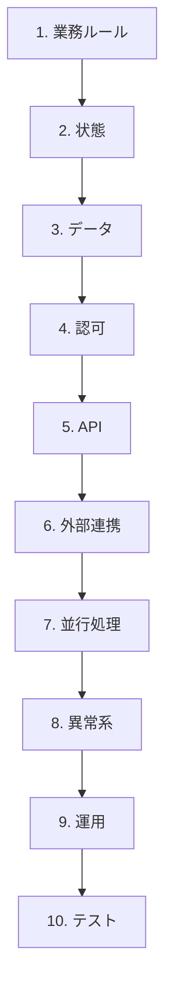

この順番は、抽象から具体へ、意味から実装へ、不可逆なものから可変なものへ進む順番です。

## 2.2 業務ルールから始める理由

業務ルールは、システムが守るべき世界の約束です。

画面やAPIは変わります。DB構造も変わります。外部サービスも変わります。しかし、業務上守るべき条件は、相対的に長く残ります。

たとえば、「支払いが確認できていない注文を発送してはいけない」というルールは、画面が変わっても、APIが変わっても、DBが変わっても守る必要があります。

業務ルールを後回しにすると、設計は「できる操作」の集まりになります。しかし、業務で本当に重要なのは「してはいけないこと」です。

弱い設計者はこう考えます。

> ユーザーは注文できる。管理者は発送できる。キャンセルできる画面を作る。

強い設計者はこう考えます。

> どの状態の注文を、誰が、どの条件で、どこまで変更してよいか。逆に、何を許すと売上、在庫、法務、顧客対応が壊れるか。

## 2.3 状態を次に考える理由

業務ルールは、多くの場合、状態に依存します。

「キャンセルできるか」は、注文が作成直後なのか、決済済みなのか、発送済みなのか、配送完了なのかによって変わります。「返金できるか」は、決済が確定しているか、既に返金済みか、一部返金済みかによって変わります。

状態を設計しないままAPIやDBを決めると、後で必ず曖昧になります。

典型的な悪い例は、状態を `pending` と `done` だけにすることです。

`pending` は便利な言葉ですが、危険です。何がpendingなのかが曖昧だからです。

- 注文作成待ちなのか
- 決済待ちなのか
- 決済確認待ちなのか
- 在庫引当待ちなのか
- 発送待ちなのか
- 外部Webhook待ちなのか
- 管理者承認待ちなのか

これらをすべて `pending` に押し込めると、業務判断ができなくなります。さらに、後から新しい状態を追加すると、既存の `pending` データが何を意味していたのか分からなくなります。

## 2.4 データを状態の後に考える理由

データは、業務上の事実を保存するためのものです。

状態を決めずにデータを決めると、DBは「画面に表示する値の置き場」になります。しかし、良いDB設計は、画面の置き場ではなく、業務事実の保存場所です。

たとえば、注文金額を保存する場合、現在の商品価格を参照すればよいように見えるかもしれません。しかし、商品価格は将来変わります。過去注文の金額は、注文時点の事実として保存しなければなりません。

同じように、ユーザーの電話番号を注文の連絡先として参照するだけでは危険です。ユーザーが電話番号を変更すると、過去注文の連絡先まで変わってしまいます。これは、履歴の崩壊です。

状態が決まると、どの事実をいつ保存すべきかが見えます。

## 2.5 認可をAPIより前に考える理由

認可は、「誰が何をしてよいか」を決める設計です。

APIを先に考えると、認可は後付けのチェックになりがちです。たとえば、`PUT /orders/{id}` があるとします。このAPIは何を変更できるのでしょうか。

- ユーザーが配送先を変更する
- 管理者が配送先を修正する
- 倉庫担当者が発送状態にする
- CS担当者がキャンセルする
- バッチが期限切れにする

これらをすべて同じ `PUT /orders/{id}` に押し込むと、認可は複雑になります。誰が、どのフィールドを、どの状態で変更できるかが曖昧になります。

強い設計者は、APIを作る前に操作の主体を分けます。

- 顧客による注文キャンセル
- CSによる例外キャンセル
- 倉庫による発送確定
- 決済Webhookによる支払い確定
- バッチによる期限切れ

操作主体を分けると、認可が自然に設計に組み込まれます。

## 2.6 APIを業務操作として考える理由

APIは、内部データのCRUD口ではありません。APIは、業務操作の入口です。

`POST /orders` は、注文レコードを作るだけではありません。注文番号発行、金額確定、在庫引当、決済開始、監査ログ記録、通知準備など、複数の業務事実を発生させます。

だからAPIは、DBテーブルに合わせて作るのではなく、業務上の意思決定に合わせて作るべきです。

悪いAPIは、データ構造を外に漏らします。

```text
POST /orders
PUT /orders/{id}
DELETE /orders/{id}
```

良いAPIは、業務操作を表現します。

```text
POST /orders/quote
POST /orders
POST /orders/{order_id}/confirm-payment
POST /orders/{order_id}/cancel
POST /orders/{order_id}/request-refund
```

もちろん、すべてを細かく分ければよいわけではありません。しかし、状態を変える重要操作、不可逆操作、外部連携を伴う操作、権限が異なる操作は、業務操作として名前を持つべきです。

## 2.7 外部連携をAPIの後に考える理由

外部連携は、自分たちが制御できない世界との境界です。

設計者は、外部APIを「呼べば結果が返るもの」と考えがちです。しかし実際には、外部APIは遅延します。失敗します。成功したのにレスポンスが届かないことがあります。Webhookが重複します。順序が入れ替わります。仕様変更されます。

外部連携を考えるときは、次を明確にする必要があります。

- どちらのシステムが状態の正か
- 外部操作は冪等か
- タイムアウト時に再試行してよいか
- 同じWebhookが2回来たらどうするか
- 外部は成功、内部は失敗した場合どう復旧するか
- 内部は成功、外部は失敗した場合どう扱うか

外部連携は異常系の入口です。だから、APIの形を決めた後、すぐに外部連携の壊れ方を考える必要があります。

## 2.8 並行処理を異常系より前に考える理由

並行処理は、異常系ではありません。通常発生する現実です。

ユーザーは二重クリックします。ブラウザはリトライします。スマホとPCで同時操作します。Webhookは重複します。バッチは再実行されます。管理者とユーザーが同時に操作します。

これらを「レアケース」と見なすと事故になります。並行処理は、Webサービスの標準状態です。

並行処理を考えずに異常系だけ考えると、失敗時の分岐は書けても、同時成功の衝突を防げません。

たとえば、在庫1個の商品を2人が同時に購入するケースは、エラーではありません。両者のリクエストは正常です。しかし、両方を成功させると業務が壊れます。これは、並行処理設計で防ぐべき問題です。

## 2.9 異常系を運用より前に考える理由

異常系を設計しないまま運用を考えると、運用は「困ったらDBを直す」になります。

しかし、異常系を設計しておけば、運用はシステムに組み込めます。

- 再試行できる失敗
- 再試行してはいけない失敗
- 手動確認が必要な失敗
- 外部照会で復旧できる失敗
- 顧客連絡が必要な失敗
- 監査ログが必要な操作

これらを分類しておけば、管理画面、リトライキュー、調査ログ、アラート、復旧手順を設計できます。

## 2.10 テストを最後に置く理由と、最後だけにしない理由

思考順序としては、テストは最後に出てきます。なぜなら、テストは設計の結果を検証するものだからです。

しかし、強い設計者は、テストを最後まで待ちません。設計中にテスト観点を出します。

理由は単純です。テストしづらい設計は、理解しづらい設計であり、壊れやすい設計であることが多いからです。

たとえば、注文状態が曖昧で、`pending` の中に複数の意味が混ざっている場合、テストケースも曖昧になります。

```text
pending の注文はキャンセルできるか？
```

この問いに答えられないなら、設計が曖昧です。

テスト観点は、設計の曖昧さを照らすライトです。

## 2.11 強い設計者と弱い設計者の比較

| 領域 | 弱い設計者の考え方 | 強い設計者の考え方 |
|---|---|---|
| 業務ルール | できることを書く | してはいけないこと、不変条件を書く |
| 状態 | pending/done で済ませる | 途中状態、禁止遷移、変更主体を書く |
| データ | 画面に必要な値を保存する | 業務事実、履歴、意味変更に耐える形で保存する |
| 認可 | API実装時にチェックする | 操作主体と状態ごとの許可を先に設計する |
| API | CRUDで作る | 業務操作、冪等性、不可逆性で分ける |
| 外部連携 | 成功レスポンス前提で考える | timeout、重複、順序逆転、照合を前提にする |
| 並行処理 | レアケース扱いする | 通常発生する現実として制約で防ぐ |
| 異常系 | try-catchで考える | どの事実が残るかで考える |
| 運用 | 問題が起きたら調べる | 調査可能性、復旧可能性を最初から設計する |
| テスト | 実装後に作る | 設計の曖昧さを見つける道具として使う |

---

# 第3章 業務ルール設計

## 3.1 業務ルールとは何か

業務ルールとは、システムの中で守らなければならない業務上の約束です。

業務ルールは、画面の仕様でも、DBの制約でも、APIの一覧でもありません。それらの背後にある「世界のルール」です。

たとえば、ECサービスであれば次のようなルールがあります。

- 支払いが確定していない注文は発送してはならない
- 発送済み注文は、通常キャンセルできない
- 返金額は支払額を超えてはならない
- 同じ決済成功イベントで売上を二重計上してはならない
- 退会済みユーザーの個人情報表示は制限されるべきである
- 過去注文の金額は、商品価格変更によって変わってはならない

業務ルールは、システムの安全性を決めます。画面が多少使いにくくても、業務ルールが守られていれば致命傷にならないことがあります。しかし、業務ルールが壊れると、売上、在庫、法務、顧客対応、監査が壊れます。

## 3.2 「何ができるか」より「何をしてはいけないか」

要件定義では、「ユーザーは注文できる」「管理者はキャンセルできる」「決済できる」といった機能要求が書かれがちです。

しかし、設計で重要なのは、それだけではありません。

「注文できる」よりも重要なのは、「どの条件では注文してはいけないか」です。

- 在庫がない商品を注文してはいけない
- 価格が未確定の商品を注文してはいけない
- 利用停止中のユーザーが注文してはいけない
- 期限切れクーポンを使って注文してはいけない
- 同じ注文リクエストで複数の注文を作ってはいけない

「キャンセルできる」よりも重要なのは、「どの条件ではキャンセルしてはいけないか」です。

- 発送済み注文を通常キャンセルしてはいけない
- 既に返金済みの注文に対して再度全額返金してはいけない
- 不正調査中の注文をユーザー操作でキャンセルしてはいけない
- 倉庫で出荷作業中の注文を、倉庫停止なしにキャンセル済みにしてはいけない

禁止事項は、システムの境界線です。境界線がない設計は、自由に見えて危険です。

## 3.3 不変条件

不変条件とは、システムがどの状態にあっても守らなければならない条件です。

不変条件の例を挙げます。

```text
返金合計額 <= 支払確定額
発送指示は、支払確定後にのみ作成される
キャンセル済み注文に対して新規発送指示を作成しない
注文金額は注文確定後に商品マスタ変更で変わらない
同じ外部決済イベントは一度だけ業務反映される
```

不変条件は、設計レビューで非常に重要です。なぜなら、不変条件は実装方法に依存しないからです。

どのAPIで実装するか、どのDBを使うか、同期か非同期か、マイクロサービスかモノリスかに関係なく、不変条件は守る必要があります。

強い設計者は、まず不変条件を置きます。そして、状態設計、データ設計、API設計、テスト設計を、不変条件を守るために組み立てます。

## 3.4 状態依存ルール

多くの業務ルールは、状態に依存します。

たとえば、注文キャンセルの可否は状態によって変わります。

| 注文状態 | ユーザーキャンセル | CSキャンセル | 理由 |
|---|---:|---:|---|
| created | 可 | 可 | まだ決済前、影響が小さい |
| payment_pending | 可 | 可 | 決済未確定ならキャンセル可能 |
| paid | 条件付き可 | 可 | 発送準備前なら可能 |
| preparing_shipment | 不可 | 条件付き可 | 倉庫作業との調整が必要 |
| shipped | 不可 | 原則不可 | キャンセルではなく返品扱い |
| delivered | 不可 | 不可 | 返品・返金フローへ移行 |
| canceled | 不可 | 不可 | 既に終了状態 |

ここで重要なのは、「キャンセルできる」という一文では不十分だということです。

キャンセルという操作は、状態によって意味が変わります。決済前キャンセルは単に注文を無効にするだけかもしれません。決済後キャンセルは返金を伴います。発送準備中キャンセルは倉庫作業停止を伴います。発送済みはキャンセルではなく返品処理です。

同じ言葉でも、状態が違えば業務上の意味が違います。

## 3.5 要件の単純な裏返しが弱い理由

要件に「会員は注文できる」と書かれているとします。

弱い禁止事項は、これを単純に裏返します。

```text
非会員は注文できない
```

これは間違いではありません。しかし、設計上の価値は低いです。なぜなら、要件の表面を反転しただけで、業務が壊れる条件を発見していないからです。

本当に意味のある禁止事項は、業務事故を防ぎます。

```text
在庫引当が成功していない注文を支払い確定済みにしてはならない
支払い確定していない注文を発送指示対象にしてはならない
注文確定後の商品価格変更で、過去注文金額を変えてはならない
同一 idempotency key に対して複数の注文を作成してはならない
同一 payment_event_id を複数回売上反映してはならない
```

これらは、単なる要件の裏返しではありません。システムが壊れる具体的な経路を防いでいます。

禁止事項を書く目的は、「できること」を否定形にすることではありません。「許すと世界が壊れること」を見つけることです。

## 3.6 悪い業務ルール設計

### 悪い例

```text
- ユーザーは商品を注文できる
- ユーザーは注文をキャンセルできる
- 管理者は注文を発送できる
- 決済ができる
- メールを送信する
```

一見、必要な機能が書かれているように見えます。しかし、これは業務ルールではなく、機能一覧です。

この書き方が危険な理由は、制約がないことです。

「いつ」「誰が」「どの状態で」「何をしてはいけないか」が分かりません。これでは、開発者ごとに解釈が分かれます。

ある開発者は、決済前でも発送可能にするかもしれません。別の開発者は、発送済みでもキャンセルできるようにするかもしれません。さらに別の開発者は、キャンセル時の返金処理を後回しにするかもしれません。

機能一覧だけの設計は、実装者の善意と暗黙知に依存します。暗黙知に依存する設計は、メンバー交代、仕様追加、障害対応、外部委託、運用引き継ぎで破綻します。

## 3.7 良い業務ルール設計

### 良い例

```text
不変条件:
- paid ではない注文に対して shipment_instruction を作成してはならない
- canceled / refunded / expired の注文は発送対象にしてはならない
- refund_total_amount は captured_amount を超えてはならない
- order_total_amount は注文確定時点の明細金額合計として固定し、商品マスタ変更で再計算してはならない
- 同一 payment_event_id は一度だけ業務反映する

状態依存ルール:
- created: ユーザーキャンセル可。決済開始可。
- payment_pending: ユーザーキャンセル可。ただし決済事業者への取消照会が必要な場合がある。
- paid: 発送準備前のみユーザーキャンセル可。キャンセル時は返金要求を作成する。
- preparing_shipment: ユーザーキャンセル不可。CSのみ倉庫停止確認後に例外キャンセル可。
- shipped: キャンセル不可。返品フローへ誘導する。

禁止事項:
- 決済成功Webhookを受け取る前に paid にしてはならない。ただし外部照会で成功確認できた場合は例外として監査ログ付きで遷移可。
- 管理者手動変更で状態を戻す場合、理由、実行者、変更前後状態を audit_log に残さなければならない。
- 期限切れ注文を後から paid にしてはならない。ただし決済事業者成功が確認できる場合は復旧フローで処理する。
```

この設計は、単に「できること」を書いていません。業務上壊してはいけない条件を明示しています。

この設計が強い理由は、実装判断を助けるからです。API、DB制約、状態遷移、テストケース、運用手順が、このルールから導けます。

## 3.8 業務ルールから設計要素への変換

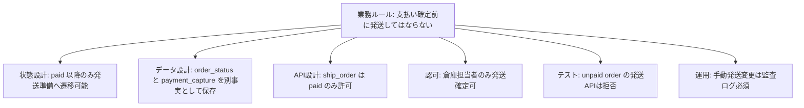

良い業務ルールは、後続設計の起点になります。

悪い業務ルールは、後続設計に変換できません。「ユーザーは注文できる」だけでは、DB制約もテストケースも運用手順も導けません。

## 3.9 業務ルール設計のレビュー問い

- できることだけでなく、してはいけないことが書かれているか
- 不変条件は明文化されているか
- 状態ごとの許可・禁止が書かれているか
- 同じ言葉が状態によって違う意味になる箇所を分解しているか
- 要件の単純な裏返しではなく、事故を防ぐ禁止事項になっているか
- 将来の仕様追加時にも守るべき条件として使えるか
- そのルールからAPI、DB制約、テスト、運用を導けるか

---

# 第4章 状態設計

## 4.1 状態はなぜ重要なのか

Webサービス設計で最も考慮漏れを生みやすい領域の一つが状態です。

状態とは、単なるステータス名ではありません。状態とは、過去に起きた業務事実の要約です。

たとえば、注文が `paid` であるとは、単に `status = 'paid'` という文字列を持つことではありません。それは、支払いが確認され、注文金額が確定し、発送準備に進める可能性があるという業務上の意味を持ちます。

状態を曖昧にすると、システムは「今何が起きているか」を判断できなくなります。判断できないシステムは、誤った操作を許します。

状態設計が弱いと、次のような問題が起きます。

- キャンセルできるか判断できない
- 再試行してよいか判断できない
- 外部連携の結果をどこに反映すべきか分からない
- 管理画面に何を表示すべきか分からない
- バッチ対象を正しく抽出できない
- 障害時に復旧手順が分からない
- テスト観点が曖昧になる

状態は、業務判断の土台です。

## 4.2 「pending / done」が危険な理由

`pending` と `done` は、最も危険な状態名の一つです。

なぜなら、抽象度が高すぎるからです。

`pending` は「何かを待っている」という意味ですが、何を待っているのか分かりません。

- ユーザー入力を待っている
- 決済開始を待っている
- 決済事業者の応答を待っている
- Webhookを待っている
- 在庫引当を待っている
- 管理者承認を待っている
- バッチ処理を待っている
- 外部照会を待っている

すべて `pending` と呼べます。しかし、これらは許可される操作も、再試行方法も、タイムアウト処理も、運用対応も違います。

`done` も同じです。何が完了したのでしょうか。

- 注文受付が完了した
- 決済が完了した
- 発送が完了した
- 配送が完了した
- 返金が完了した
- 通知が完了した

`done` は、読み手に「終わった」という安心感を与えます。しかし、業務上は何が終わったかが重要です。

## 4.3 途中状態を潰すと危険な理由

途中状態を省略すると、設計は簡単に見えます。

```text
注文前 → 注文完了
```

しかし、現実には「注文完了」の前に多くの事実が発生します。

- 注文入力が完了した
- 金額が確定した
- 在庫が引き当てられた
- 決済が開始された
- 決済が承認された
- 決済が確定した
- 注文が確定した
- 通知が送信された

途中状態を潰すと、partial success が見えなくなります。

たとえば、決済は成功したが注文確定DB更新に失敗した場合、状態が `注文前` と `注文完了` しかなければ、この中間事実を表現できません。すると、復旧は人間の記憶やログ調査に依存します。

途中状態は、失敗を保存するために必要です。

状態は、成功のためだけでなく、失敗から復旧するためにあります。

## 4.4 rollback を状態設計で考える

多くの設計者は rollback を「失敗したら元に戻す」と考えます。しかし、Webサービスでは完全な rollback ができないことが多いです。

特に外部連携や決済が絡む場合、外部で発生した事実は簡単には消せません。

決済成功後に自社DB更新が失敗したとします。このとき、「DBを元に戻す」だけでは足りません。外部決済ではお金が動いている可能性があります。必要なのは、rollback ではなく、補償処理です。

- 外部決済成功を照会する
- 自社注文を復旧する
- 復旧できない場合は返金する
- 顧客対応が必要なら通知する
- 監査ログを残す

状態設計では、「戻す」だけでなく、「戻せない事実をどう扱うか」を考えます。

良い状態設計には、失敗状態や復旧待ち状態が含まれます。

```text
payment_confirming
payment_captured
order_recovery_required
refund_required
```

これらは、見た目には複雑です。しかし、現実に存在する業務事実を表現しているため、運用時に強いです。

## 4.5 誰が状態変更するか

状態遷移には、必ず主体があります。

- ユーザー操作
- 管理者操作
- CS操作
- 倉庫担当者操作
- 決済Webhook
- バッチ
- システム自動処理
- 手動復旧

同じ状態遷移でも、主体が違えば意味が違います。

たとえば、`paid -> canceled` という遷移があります。

ユーザーによるキャンセルなら、返金処理が必要です。CSによるキャンセルなら、理由コードや承認者が必要かもしれません。システム自動キャンセルなら、期限切れや不正検知が理由かもしれません。

主体を書かない状態遷移図は危険です。誰が遷移させるか分からないと、認可、監査、通知、テストが設計できません。

## 4.6 禁止遷移

状態遷移図では、可能な遷移だけでなく、禁止遷移が重要です。

多くの図は、「行ける矢印」だけを書きます。しかし設計レビューでは、「行ってはいけない矢印」を確認する必要があります。

たとえば、次の遷移は禁止すべきです。

```text
canceled -> shipped
refunded -> preparing_shipment
expired -> paid  （通常フローでは禁止。復旧フローのみ例外）
shipped -> payment_pending
```

禁止遷移を明示しないと、後から誰かが「必要そうだから」と実装してしまうことがあります。特に管理画面やバッチは、禁止遷移の抜け穴になりやすいです。

## 4.7 悪い状態遷移図

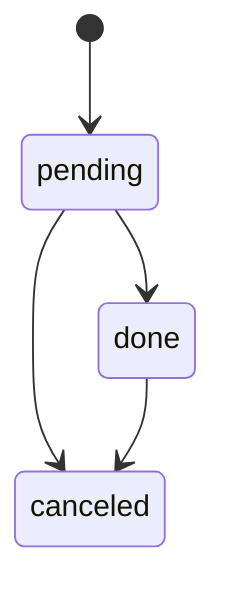

この図は、非常に危険です。

一見シンプルですが、業務判断に必要な情報が消えています。

### なぜ危険なのか

第一に、`pending` が何を待っているのか分かりません。決済待ちなのか、発送待ちなのか、外部承認待ちなのかが不明です。

第二に、`done` が何の完了を意味するのか分かりません。決済完了なのか、注文完了なのか、発送完了なのか、配送完了なのかが不明です。

第三に、`done -> canceled` が許可されています。もし `done` が発送完了を意味するなら、キャンセルではなく返品フローにすべきです。もし `done` が決済完了を意味するなら、キャンセル時に返金が必要です。この図だけでは判断できません。

第四に、外部連携失敗、決済確認中、返金待ち、復旧待ちが表現できません。つまり、障害時にどこにいるか分からなくなります。

### どう壊れるのか

この図をもとに実装すると、次のような事故が起きます。

- 決済成功済みなのに `pending` のまま残り、バッチが期限切れキャンセルする
- 発送済みなのに `done -> canceled` が許可され、倉庫と顧客対応が矛盾する
- メール送信失敗を `pending` として扱い、注文未完了だと誤認する
- 決済Webhook重複時に `done` を再処理し、二重売上計上する
- 管理画面で `done` の意味を担当者が誤解し、誤った復旧を行う

### 将来的にどう破綻するのか

最初は、注文と決済が単純なサービスなら動くかもしれません。しかし、以下の仕様が追加されると破綻します。

- コンビニ決済など、支払い完了まで時間がかかる決済手段
- 一部返金
- 予約注文
- 倉庫連携
- 不正検知
- キャンセル期限
- 手動復旧
- 外部Webhook遅延

`pending` と `done` に意味を詰め込みすぎると、既存データの意味が分からなくなります。ある時期の `pending` は決済待ち、別の時期の `pending` は倉庫待ち、さらに別の時期の `pending` はメール送信待ちになる。これが状態意味の崩壊です。

## 4.8 良い状態遷移図

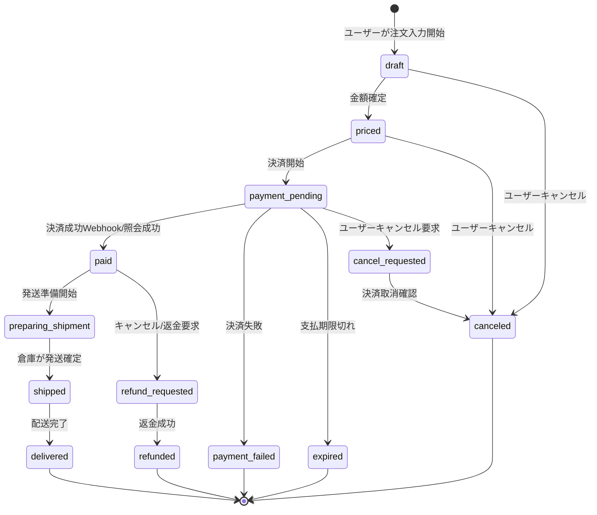

この図は、悪い図より複雑です。しかし、複雑に見える理由は、現実の業務事実を隠していないからです。

### なぜこの図が良いのか

第一に、状態名が業務事実を表しています。

`payment_pending` は決済待ちです。`preparing_shipment` は発送準備中です。`refund_requested` は返金要求済みです。それぞれ、何を待っているか、次に何をすべきかが分かります。

第二に、途中状態があります。

`cancel_requested` や `refund_requested` があることで、ユーザーがキャンセル要求を出したが、外部決済の取消や返金がまだ完了していない状態を表現できます。この途中状態がなければ、キャンセル要求とキャンセル完了が混同されます。

第三に、決済失敗、期限切れ、返金成功など、終了状態が分かれています。

終了状態を分けると、分析、顧客対応、再試行可否、監査がしやすくなります。単に `done` や `closed` にすると、なぜ終了したのかが失われます。

第四に、操作主体が矢印ラベルに見えます。

ユーザー、Webhook、照会、倉庫など、誰が状態を変えるかが分かります。これにより、認可と監査が設計できます。

## 4.9 さらに良い状態遷移表

図だけでは、条件や副作用を十分に表せません。実務では、状態遷移図と状態遷移表を併用します。

| 現在状態 | 操作 | 主体 | 次状態 | 条件 | 副作用 | 禁止理由 |
|---|---|---|---|---|---|---|
| draft | 金額確定 | system | priced | 商品価格・在庫確認済み | 注文明細金額を固定 | 価格未確定なら不可 |
| priced | 決済開始 | user | payment_pending | idempotency key 有効 | payment_attempt 作成 | 重複決済防止 |
| payment_pending | 決済成功 | payment_webhook | paid | event_id 未処理 | capture 記録、売上計上 | 重複イベントは無視 |
| payment_pending | 期限切れ | batch | expired | 支払期限超過、決済成功未確認 | 在庫引当解除 | 成功確認済みなら不可 |
| paid | 発送準備開始 | warehouse | preparing_shipment | キャンセル要求なし | shipment_instruction 作成 | canceled/refund_requested は不可 |
| preparing_shipment | 発送確定 | warehouse | shipped | 送り状番号あり | 通知ジョブ作成 | 決済未確定なら不可 |
| paid | 返金要求 | user/cs | refund_requested | 発送準備前またはCS承認 | refund_request 作成 | shipped は返品扱い |
| refund_requested | 返金成功 | payment_webhook | refunded | refund_event_id 未処理 | refund 記録 | 二重返金防止 |

状態遷移表の価値は、図では見えにくい条件と副作用を明示することです。

特に「副作用」は重要です。状態変更は、単に `status` を更新するだけではありません。外部API呼び出し、監査ログ、通知ジョブ、在庫解除、返金要求などを伴います。副作用が見えない状態遷移は、実装時に漏れます。

## 4.10 状態設計の良い例と悪い例の比較

| 観点 | 悪い状態設計 | 良い状態設計 |
|---|---|---|
| 状態名 | pending / done | payment_pending / paid / shipped / refunded |
| 途中状態 | 省略する | cancel_requested / refund_requested を持つ |
| 失敗状態 | 例外ログだけ | payment_failed / recovery_required を持つ |
| 主体 | 書かない | user / webhook / batch / admin を書く |
| 禁止遷移 | 暗黙 | 明示する |
| 副作用 | 実装で考える | 遷移表に書く |
| 運用 | ログを見るしかない | 復旧対象状態を抽出できる |
| 将来変更 | 状態に意味を詰め込む | 新状態を追加しても意味が保てる |

## 4.11 状態設計でよくある失敗

### 失敗1: 状態とフラグが混在する

```text
status = paid
is_canceled = true
is_refunded = false
```

このような設計は、矛盾状態を作ります。`paid` で `is_canceled = true` はあり得るかもしれませんが、返金待ちなのか、キャンセル完了なのか、発送停止済みなのか分かりません。

フラグを増やすと、状態空間が爆発します。3つのbooleanは8通り、5つなら32通りです。その多くは業務上あり得ない組み合わせです。

状態設計では、業務上意味のある組み合わせだけを状態として表現し、矛盾状態を作らないことが重要です。

### 失敗2: 失敗状態を持たない

```text
決済API失敗時は例外ログに出す
```

これは運用できません。例外ログは、業務状態ではありません。

決済APIが失敗したなら、その注文が再試行対象なのか、顧客操作待ちなのか、手動確認対象なのかを状態として表現する必要があります。

### 失敗3: 管理者なら何でも遷移できる

管理者向けの「ステータス変更」機能は非常に危険です。

```text
管理者は任意の status に変更できる
```

これを許すと、禁止遷移が崩壊します。支払い未確定の注文を発送済みにする、返金済み注文を発送準備に戻す、キャンセル済み注文をpaidに戻す、といった事故が起きます。

管理者機能にも、状態遷移ルールが必要です。例外遷移が必要なら、理由、承認、監査ログ、関連副作用を必須にすべきです。

## 4.12 状態設計のレビュー問い

- 状態名は業務事実を表しているか
- `pending` や `done` に複数の意味を詰め込んでいないか
- 途中状態が省略されていないか
- 失敗状態、復旧待ち状態があるか
- 誰が状態を変えるか明確か
- 状態遷移ごとの条件、副作用、監査が書かれているか
- 禁止遷移が明示されているか
- 管理者操作でも禁止遷移を破れないか
- 状態とbooleanフラグの組み合わせで矛盾状態を作っていないか
- 外部連携の遅延、重複、失敗を状態で表現できるか


---

# 第5章 データ設計

## 5.1 データ設計は「値の置き場」ではない

データ設計を、画面に表示する値やフォーム入力値の置き場として考えると、将来必ず壊れます。

データは、業務上の事実を保存するためのものです。

この違いは非常に重要です。

画面に表示する値は、今見せたい情報です。一方、業務上の事実は、後から検証、監査、復旧、集計、問い合わせ対応、法務対応を行うために必要な情報です。

たとえば、注文画面には「合計金額」が表示されます。弱い設計では、注文テーブルに `total_amount` だけを持ち、商品マスタから現在価格を参照します。しかし、商品価格は変わります。キャンペーンも変わります。税率も変わります。クーポン仕様も変わります。

過去注文の金額は、現在の商品価格から再計算してはいけません。注文時点で確定した明細金額、税額、割引額、送料を保存する必要があります。

データ設計の基本は、「将来、意味が変わる値」と「過去に起きた事実」を分けることです。

## 5.2 データ意味変更の危険性

データの値そのものより危険なのは、意味の変更です。

たとえば、`user.phone_number` というカラムがあるとします。最初は「本人確認済みの電話番号」として使っていました。しかし後から、「連絡先電話番号」としても使い始めた。さらに後から、「SMS送信用番号」として使い始めた。

同じカラムが、時期によって違う意味を持つようになります。

これがデータ意味変更です。

データ意味変更が起きると、次の問題が発生します。

- 過去データを現在ルールで解釈してしまう
- 集計結果が時期によって不正確になる
- 監査時に、その値が何を意味していたか分からない
- API利用者が同じフィールドを違う意味で使う
- 条件分岐が増え、実装が読めなくなる

データ意味変更は、単なるカラム名の問題ではありません。業務の意味が保存されていない問題です。

## 5.3 現在値だけ持つ危険性

現在値だけを持つ設計は、短期的には簡単です。しかし、履歴、監査、過去問い合わせ、法務、分析で破綻します。

たとえば、ユーザーの住所を `users.address` に現在値として保存し、注文は `user_id` だけを持つ設計を考えます。

注文時の配送先住所は、ユーザーの現在住所を参照すればよいように見えます。しかし、ユーザーが引っ越すと、過去注文の配送先住所まで変わったように見えてしまいます。

これは、履歴の改ざんです。実際にDB上で過去注文レコードを更新していなくても、参照先の現在値が変わることで、過去の意味が変わります。

この事故は、電話番号、住所、氏名、会社名、商品名、価格、税率、契約プラン、権限、組織所属など、あらゆる変わる値で起きます。

## 5.4 phone_number をキーにする危険性

電話番号は、一見ユニークに見えます。だから、ユーザー識別子やログインIDや顧客キーに使いたくなることがあります。

しかし、電話番号は人ではありません。電話番号は変わります。解約され、再割り当てされ、誤入力され、複数人で共有され、法人代表番号として使われ、国際表記が変わり、SMS受信可否も変わります。

`phone_number` を主キーや業務上の永続識別子にすると、次の問題が起きます。

- ユーザーが電話番号を変更すると、過去の注文や問い合わせとの紐づきが壊れる
- 電話番号の再利用により、別人の履歴が紐づく可能性がある
- 表記ゆれにより同一人物が重複登録される
- 家族共有番号や法人番号で一意性が崩れる
- SMS認証番号と連絡先番号の意味が混ざる
- 国番号、ハイフン、全角半角、先頭ゼロなど正規化問題が発生する

電話番号は、識別子ではなく属性です。識別子には、システムが発行し、意味を持たず、変わらず、再利用されない値を使うべきです。

## 5.5 一意性は業務ルールである

UNIQUE制約は、単なるDBの最適化ではありません。一意性は業務ルールです。

たとえば、次の一意性があります。

```text
users.email は有効ユーザー内で一意
orders.order_number は全注文で一意
payment_events.external_event_id は一意
idempotency_keys.key は一定期間内で一意
customer_contracts は同一顧客・同一期間で重複してはならない
```

一意性をアプリケーションのif文だけで守ると、並行処理で壊れます。

```text
1. 注文番号が未使用か確認
2. 未使用なら注文を作成
```

この処理は、同時に2リクエストが来ると両方が「未使用」と判断する可能性があります。だから、最終防衛線としてDBのUNIQUE制約が必要です。

良いデータ設計では、「何が一意であるべきか」を業務ルールとして明示し、DB制約に落とします。

## 5.6 valid_from / valid_to の意味

履歴管理では、`valid_from` と `valid_to` がよく使われます。

しかし、これも意味を理解せずに使うと危険です。

`valid_from` / `valid_to` は、「そのデータが業務上有効だった期間」を表すためのものです。単に作成日時、更新日時の別名ではありません。

たとえば、契約プラン履歴を考えます。

| customer_id | plan | valid_from | valid_to |
|---|---|---|---|
| C001 | basic | 2026-01-01 | 2026-03-31 |
| C001 | pro | 2026-04-01 | null |

この設計では、2026年2月時点の顧客プランはbasic、2026年4月時点はproと判断できます。

重要なのは、現在値だけでなく、任意時点の事実を復元できることです。

ただし、`valid_from` / `valid_to` には注意点があります。

- 期間が重複してはいけない
- 期間に穴があってよいかを決める必要がある
- `valid_to` を含むか含まないかを統一する必要がある
- 未来予約変更を許すかを決める必要がある
- 過去訂正をどう監査するかを決める必要がある

履歴は、カラムを足すだけでは成立しません。期間制約、訂正ルール、参照ルールが必要です。

## 5.7 悪いER図

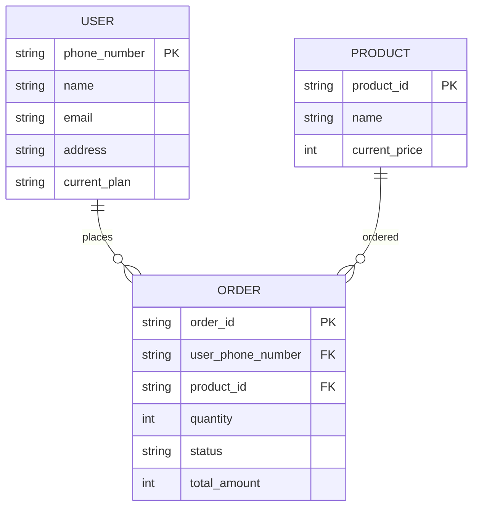

このER図は、初期実装には便利に見えます。しかし、実務では危険です。

### なぜ危険なのか

第一に、`phone_number` が主キーになっています。電話番号変更、再利用、表記ゆれ、共有番号に耐えられません。ユーザーの識別子として不適切です。

第二に、注文が `user_phone_number` でユーザーに紐づいています。ユーザーが電話番号を変更すると、過去注文との関係が壊れます。電話番号を更新しなければ現在ユーザーに紐づかない。更新すれば過去注文の連絡先意味が変わる。どちらにしても壊れます。

第三に、注文が `product_id` を参照し、商品価格を `PRODUCT.current_price` に依存しています。商品価格が変わると、過去注文の金額の説明ができません。`ORDER.total_amount` を保存していても、内訳、税、割引、価格確定時点が不明です。

第四に、`USER.current_plan` が現在値だけです。過去注文時点のプラン、請求時点のプラン、契約変更予約を表現できません。

第五に、`ORDER.status` が単一文字列です。状態遷移履歴がなく、誰がいつ変更したか、なぜ変更したかが分かりません。

### どう履歴崩壊するのか

ユーザーAが電話番号 `090-1111-2222` で注文したとします。後日、ユーザーAが電話番号を変更しました。さらに、その古い電話番号がユーザーBに再割り当てされたとします。

電話番号をキーにしていると、過去注文が誰のものか曖昧になります。ユーザーBの本人確認時に、ユーザーAの過去注文が紐づく危険があります。

商品価格でも同じです。2026年1月に1,000円で注文された商品が、2026年5月に1,500円に値上げされる。過去注文の明細が商品マスタ現在価格に依存していると、問い合わせ時に「なぜこの注文は1,000円なのか」を説明できなくなります。

履歴崩壊とは、過去の業務事実を、現在の値で上書きしてしまうことです。

### 将来どう破綻するのか

このER図は、次の仕様追加で破綻します。

- 電話番号変更
- 複数配送先
- 注文時点の商品名表示
- 税率変更
- クーポン、ポイント、送料
- 契約プラン履歴
- 返金、一部返金
- 注文状態履歴
- 監査ログ
- 退会後の個人情報マスキング

最初に「簡単だから」と現在値参照にすると、後から履歴を復元できません。過去に保存していない事実は、後から正確には作れません。

## 5.8 良いER図

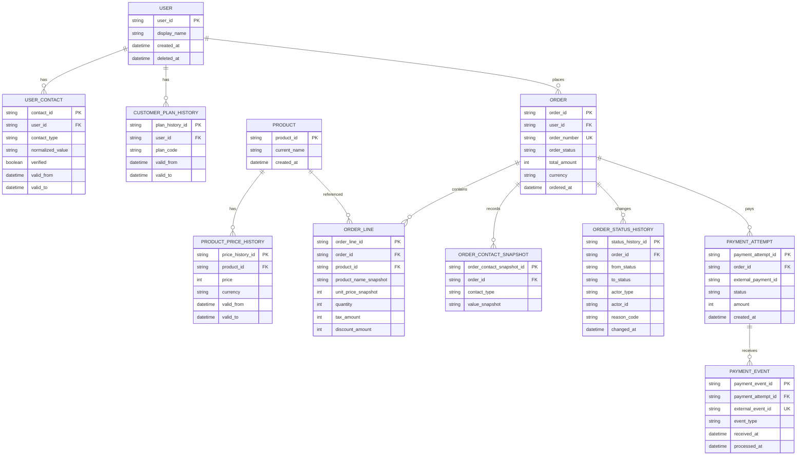

このER図は、悪いER図より多くのテーブルを持ちます。しかし、複雑にしたいから増やしているのではありません。変わる値、過去の事実、外部イベント、状態履歴を分離しているのです。

### なぜこのER図が良いのか

第一に、ユーザー識別子が `user_id` です。電話番号は `USER_CONTACT` の属性として扱われ、履歴を持ちます。電話番号変更が起きても、ユーザーの同一性は保たれます。

第二に、注文時点の連絡先を `ORDER_CONTACT_SNAPSHOT` として保存しています。これにより、ユーザーが後から電話番号や住所を変えても、過去注文の連絡先事実は保たれます。

第三に、商品価格履歴と注文明細スナップショットが分かれています。商品マスタの現在名や現在価格が変わっても、注文時点の商品名、単価、税、割引を説明できます。

第四に、状態履歴があります。`ORDER.order_status` は現在状態、`ORDER_STATUS_HISTORY` は変化の履歴です。誰が、いつ、なぜ状態を変えたかが追跡できます。

第五に、外部決済イベントが `PAYMENT_EVENT` として保存され、`external_event_id` に一意性があります。Webhook重複を防ぎ、外部イベントの処理状況を追えます。

## 5.9 良いER図にも注意点がある

良いER図は、テーブルを増やせばよいという意味ではありません。

履歴テーブルを作っても、参照ルールがなければ意味がありません。たとえば、価格履歴があっても、注文金額を注文時点でスナップショットしないなら、過去注文は依然として壊れます。

履歴設計では、次を決める必要があります。

- どの時点の値を保存するか
- 現在値を参照してよい場面はどこか
- 過去値を参照すべき場面はどこか
- 訂正と変更をどう区別するか
- 削除ではなく無効化すべきデータは何か
- 監査ログと業務履歴をどう分けるか

たとえば、ユーザーの現在住所はマイページ表示に使えます。しかし、過去注文の配送先には使ってはいけません。注文時配送先はスナップショットであるべきです。

## 5.10 監査ログと業務履歴の違い

監査ログと業務履歴は似ていますが、目的が違います。

業務履歴は、業務状態を判断するための履歴です。

```text
注文が paid から shipped に変わった
返金要求が作られた
契約プランが basic から pro に変わった
```

監査ログは、誰が何をしたかを説明するための履歴です。

```text
CS担当者U123が、理由コードCUSTOMER_REQUESTで注文O456をキャンセルした
管理者A001が、手動復旧で payment_captured に変更した
バッチJOB789が、期限切れ注文をexpiredにした
```

業務履歴だけでは、不正操作や運用判断を追えません。監査ログだけでは、業務状態を効率よく判断できません。

良い設計では、両方の目的を分けます。

## 5.11 データ設計のレビュー問い

- その値は現在値か、過去の事実か
- 将来変わる値をキーにしていないか
- 電話番号、メールアドレス、住所、商品名、価格、所属、権限を永続識別子にしていないか
- 注文時点、契約時点、請求時点など、必要な時点の値を復元できるか
- 履歴の期間重複を防ぐ制約があるか
- 一意性はDB制約として守られているか
- 外部イベントIDの重複を防げるか
- 状態履歴と監査ログが分かれているか
- 削除してはいけないデータを物理削除していないか
- 退会、匿名化、法務保持の要件を考慮しているか

---

# 第6章 API設計

## 6.1 APIはCRUDではなく業務操作で考える

API設計でよくある失敗は、DBテーブルをそのままHTTPメソッドに変換することです。

```text
POST /orders
GET /orders/{id}
PUT /orders/{id}
DELETE /orders/{id}
```

この形は分かりやすいですが、業務操作を表現しきれません。

注文を「更新する」とは何でしょうか。配送先変更、キャンセル、発送確定、決済完了、返金要求、CSメモ追加、管理者復旧は、すべて「更新」に見えるかもしれません。しかし、業務上の意味、権限、状態遷移、副作用、監査要件はまったく違います。

CRUD APIが危険なのは、操作の意味を隠すことです。

APIは、データ構造の入口ではなく、業務意思決定の入口です。

## 6.2 悪いAPI設計

```text
POST   /orders
GET    /orders/{order_id}
PUT    /orders/{order_id}
DELETE /orders/{order_id}
POST   /payments
PUT    /payments/{payment_id}
```

この設計では、どのAPIが何の業務操作を行うのか曖昧です。

### なぜ危険なのか

`PUT /orders/{order_id}` に、キャンセル、配送先変更、管理者メモ更新、発送状態更新、返金状態更新が混ざる可能性があります。すると、API内部で大量の条件分岐が発生します。

```text
if status changed to canceled then ...
if address changed then ...
if shipment_status changed then ...
if admin_note changed then ...
```

このようなAPIは、認可が壊れやすいです。ユーザーが変更してよいフィールド、管理者が変更してよいフィールド、システムだけが変更してよいフィールドが混ざるからです。

さらに、副作用が見えません。`PUT /orders/{id}` が返金要求を作るのか、倉庫連携を止めるのか、通知を送るのか、呼び出し側には分かりません。

### どう壊れるのか

- ユーザーが本来変更できない状態を更新できてしまう
- 管理者メモ更新のつもりが、状態変更副作用を発火する
- キャンセルAPIの再送で返金が二重に作られる
- 決済成功後のDB更新失敗時に、どのAPIを再実行すべきか分からない
- 監査ログに操作理由が残らない
- テストケースがフィールド組み合わせ爆発を起こす

## 6.3 良いAPI設計

良いAPIは、業務操作を名前にします。

```text
POST /order-quotes
POST /orders
POST /orders/{order_id}/cancel
POST /orders/{order_id}/request-refund
POST /orders/{order_id}/change-shipping-address
POST /orders/{order_id}/start-shipment-preparation
POST /orders/{order_id}/mark-shipped
POST /payment-webhooks/provider-x
POST /orders/{order_id}/manual-recovery
```

このAPI設計では、操作の意味が明確です。

配送先変更とキャンセルは、どちらも注文を変更します。しかし、業務上の意味が違うため、別APIにしています。これにより、認可、状態条件、冪等性、副作用、監査ログを個別に設計できます。

## 6.4 業務操作APIの例

### 注文作成API

```http
POST /orders
Idempotency-Key: 01JABC...

{
  "quote_id": "q_123",
  "payment_method_id": "pm_456",
  "shipping_address_id": "addr_789"
}
```

設計観点:

- `quote_id` により、金額・在庫・税・送料の見積もりが確定している
- `Idempotency-Key` により、二重クリックや再送で注文が重複しない
- 注文作成と決済開始の境界を明確にする
- レスポンスには注文状態と次に必要な操作を含める

### キャンセルAPI

```http
POST /orders/{order_id}/cancel
Idempotency-Key: 01JDEF...

{
  "reason_code": "CUSTOMER_REQUEST"
}
```

設計観点:

- 状態ごとにキャンセル可否が異なる
- 決済済みなら返金要求を作る
- 発送準備中なら通常ユーザーキャンセル不可
- 再送されても返金要求が重複しない
- キャンセル理由を監査ログに残す

### 決済Webhook API

```http
POST /payment-webhooks/provider-x

{
  "event_id": "evt_001",
  "event_type": "payment.captured",
  "payment_id": "pay_123",
  "amount": 5000
}
```

設計観点:

- `event_id` で重複処理を防ぐ
- 署名検証を行う
- 処理済みイベントは再度業務反映しない
- 注文が見つからない場合、復旧キューに入れる
- Webhook順序逆転に備える

## 6.5 冪等性

冪等性とは、同じ操作を複数回実行しても、業務結果が一度だけ実行された場合と同じになる性質です。

Web APIでは、冪等性が非常に重要です。

なぜなら、クライアントやネットワークは再送するからです。ユーザーは二重クリックします。ブラウザはタイムアウト後に再試行します。モバイル回線は不安定です。ロードバランサやプロキシも再送することがあります。

冪等性がない注文作成APIでは、二重クリックで注文が2件作られます。冪等性がない返金APIでは、二重返金が起きます。冪等性がないWebhook処理では、売上が二重計上されます。

冪等性は、「二重実行されないことを祈る」設計ではありません。「二重実行されても壊れない」設計です。

## 6.6 idempotency key の設計

idempotency key は、同じ業務操作を識別するキーです。

注文作成なら、クライアントが生成したキーをリクエストに付けます。サーバーは、同じキーで同じユーザーから来たリクエストに対して、同じ結果を返します。

重要なのは、idempotency key を単なるログではなく、制約として扱うことです。

```text
UNIQUE(user_id, idempotency_key, operation_type)
```

この一意性がなければ、並行リクエストで同じキーが同時に処理される可能性があります。

また、同じキーで内容が違うリクエストが来た場合の扱いも決める必要があります。

- 同じキー・同じ内容: 既存結果を返す
- 同じキー・違う内容: 409 Conflict
- キー期限切れ: 新規扱いにするか拒否するか

## 6.7 rollback と API

API設計で rollback を考えるとき、重要なのは「戻せる操作」と「戻せない操作」を分けることです。

内部DB更新だけなら、トランザクションで rollback できます。しかし、外部決済、メール送信、Webhook、配送指示などは、トランザクションの外にあります。

悪い設計では、1つのAPIで多くの不可逆操作を同期的に行います。

```text
POST /orders
  1. 注文DB作成
  2. 決済確定
  3. 倉庫発送指示
  4. メール送信
```

途中で失敗したとき、何を戻せるか分かりません。

良い設計では、業務事実ごとに境界を分けます。

```text
POST /orders
  - 注文作成
  - 決済開始要求を記録

決済Webhook
  - 決済成功を記録
  - 注文を paid に遷移
  - 発送準備ジョブを作成

発送ジョブ
  - 倉庫連携
  - 結果を shipment_instruction に記録

通知ジョブ
  - メール送信
  - 失敗時は通知再試行対象にする
```

この設計では、各段階の失敗を状態として保存できます。完全 rollback ではなく、補償処理と再試行で整合性を保ちます。

## 6.8 partial success をAPIレスポンスで隠さない

partial success とは、処理の一部は成功し、一部は失敗した状態です。

たとえば、注文作成は成功したが、メール通知に失敗した場合です。このとき、APIレスポンスを単純に `500 Internal Server Error` にすると、クライアントは注文が失敗したと思い、再送するかもしれません。すると注文が重複する危険があります。

一方で、単純に `200 OK` にすると、通知失敗が見えなくなります。

良い設計では、業務上の主処理と副作用を分けます。

```json
{
  "order_id": "ord_123",
  "status": "payment_pending",
  "notification_status": "queued",
  "next_action": "complete_payment"
}
```

メール送信は注文成立の条件ではないなら、注文APIの成功/失敗に含めるべきではありません。通知ジョブとして別管理し、失敗時は再試行・運用監視の対象にします。

## 6.9 retry を前提にしたAPI

retry は異常時の例外ではありません。分散システムでは通常の制御手段です。

retry を前提にすると、API設計は変わります。

- 同じリクエストが複数回来る
- 前回処理が成功したがレスポンスだけ失敗した可能性がある
- 再試行してはいけない操作がある
- 再試行間隔、最大回数、バックオフが必要
- クライアントとサーバーの両方が再試行する可能性がある

retry 可能なAPIには、冪等性が必要です。retry 不可能なAPIは、その理由を明示しなければなりません。

## 6.10 良いAPI設計と悪いAPI設計の比較

| 観点 | 悪いAPI | 良いAPI |
|---|---|---|
| 操作名 | CRUD中心 | 業務操作中心 |
| 状態条件 | 実装内で曖昧に判定 | APIごとに前提状態を定義 |
| 認可 | フィールド単位で複雑化 | 操作主体ごとに明確 |
| 冪等性 | 考慮なし | idempotency key / event_id で担保 |
| partial success | 500か200で隠す | 主処理と副作用を分けて表現 |
| retry | クライアント任せ | 再試行可能性を契約化 |
| rollback | 失敗したら戻すつもり | 補償処理と状態保存で復旧 |
| テスト | 組み合わせ爆発 | 操作ごとに状態条件をテスト可能 |

## 6.11 API設計のレビュー問い

- APIはDBテーブルのCRUDではなく業務操作を表しているか
- 状態を変える操作は、前提状態と遷移先が明確か
- 不可逆操作、外部連携、認可が異なる操作を同じAPIに混ぜていないか
- 冪等性が必要なAPIに idempotency key があるか
- 同じキーで異なる内容が来た場合の扱いが決まっているか
- Webhookは event_id で重複排除できるか
- partial success をどう表現するか決まっているか
- retry してよい操作と、してはいけない操作が区別されているか
- APIレスポンスは次に取るべき行動を示しているか
- 監査ログに必要な理由、主体、時刻を保存できるか

---

# 第7章 外部連携

## 7.1 外部は壊れる前提で設計する

外部連携で最も危険な考え方は、「外部APIは呼べば正しい結果を返す」という前提です。

実際の外部連携では、次のことが起きます。

- タイムアウトする
- 一時的に503を返す
- 成功したのにレスポンスが届かない
- 失敗したように見えるが外部では成功している
- Webhookが遅れて届く
- Webhookが重複して届く
- Webhookの順序が逆になる
- 外部仕様が変わる
- レート制限される
- メンテナンスで停止する
- 外部管理画面で手動操作される

外部連携は、制御できない世界との契約です。だから設計では、「成功したらどうするか」よりも、「成功したかどうか分からないときどうするか」を重視します。

## 7.2 timeout は失敗ではなく不明である

timeout を単純な失敗として扱うと危険です。

たとえば、決済APIに決済確定リクエストを送り、タイムアウトしたとします。このとき、決済は失敗したのでしょうか。

分かりません。

リクエストが外部に届く前にタイムアウトしたかもしれません。外部で処理中にタイムアウトしたかもしれません。外部では成功したが、レスポンスがネットワークで失われたかもしれません。

つまり timeout は、「失敗」ではなく「結果不明」です。

結果不明を失敗扱いして再度決済確定すると、二重決済になる可能性があります。結果不明を成功扱いすると、未決済注文を発送する可能性があります。

良い設計では、timeout 後に専用状態へ移します。

```text
payment_capture_requested
payment_capture_unknown
payment_capture_confirmed
payment_capture_failed
```

`unknown` 状態では、外部照会APIやWebhookを待ちます。必要であれば手動確認対象にします。

## 7.3 retry は設計しないと事故になる

retry は便利ですが、危険です。

再試行してよい処理と、再試行してはいけない処理があります。

たとえば、メール送信は重複しても比較的影響が小さいかもしれません。しかし、決済確定や返金は、重複すると金銭事故になります。

retry 可能にするには、外部側または自社側で冪等性を確保する必要があります。

- 外部APIに idempotency key を渡す
- 自社DBに外部リクエストIDを保存する
- 同じ業務操作に対して複数の外部要求を作らない
- retry 状態と試行回数を保存する
- 成功確認前に次工程へ進めない

retry は「もう一度呼ぶ」ではありません。retry は、同じ業務意図を安全に再実行する設計です。

## 7.4 duplicate webhook

外部Webhookは重複する前提で設計します。

決済事業者が同じ `payment.captured` イベントを2回送ることがあります。これは外部のバグとは限りません。Webhook配信では、受信側が応答しなかった場合、外部は再送します。ネットワークが不安定なら、同じイベントが複数回来るのは自然です。

悪い設計では、Webhookを受け取るたびに業務処理を実行します。

```text
payment.captured 受信
→ 注文を paid にする
→ 売上計上する
→ メール送信する
```

同じイベントが2回来ると、売上計上やメール送信が二重になります。

良い設計では、外部イベントIDで一意性を持ちます。

```text
external_event_id が未処理なら処理する
処理済みなら何もしない、または同じ結果を返す
```

DB上は次のような制約が必要です。

```text
UNIQUE(provider_name, external_event_id)
```

さらに、イベント保存と業務反映はトランザクション境界を意識します。イベントだけ保存して業務反映に失敗した場合、再処理できるように `processed_at` や `processing_status` を持たせます。

## 7.5 eventual consistency

外部連携があるシステムでは、すべてのデータが常に同時に一致するとは限りません。

たとえば、自社では注文が `payment_pending` だが、外部決済では既に `captured` になっている時間帯があります。Webhookが遅れている場合です。

このような一時的不一致を eventual consistency と呼びます。

重要なのは、一時的不一致を許すかどうかを明示することです。

悪い設計では、設計者が暗黙に「すぐ一致する」と思っています。すると、Webhook遅延時に注文が未決済としてキャンセルされたり、管理画面で誤表示されたりします。

良い設計では、整合性モデルを決めます。

- 決済状態の正は外部決済サービスにある
- 自社DBは外部決済イベントを反映したローカル状態である
- payment_pending の注文は、期限切れ前に外部照会する
- Webhook遅延に備えて reconciliation batch を実行する
- 管理画面には「外部照会中」「結果不明」を表示する

## 7.6 状態の正をどこに置くか

外部連携で最も重要な問いの一つは、「状態の正はどこにあるか」です。

たとえば、決済状態の正は自社DBでしょうか。決済事業者でしょうか。

多くの場合、金銭の最終事実は決済事業者側にあります。自社DBは、その結果を反映したローカルコピーです。しかし、注文業務状態は自社DBにあります。ここを混同すると危険です。

```text
決済成功という金銭事実の正: 決済事業者
注文を発送してよいかという業務判断の正: 自社システム
```

自社システムは、外部決済の事実を取り込み、業務ルールに基づいて注文状態を変えます。

外部の正と内部の正を分けないと、「外部が成功なら即発送」といった短絡が起きます。しかし、注文が不正調査中、在庫引当失敗、キャンセル要求中であれば、決済成功でも発送してはいけない場合があります。

## 7.7 外部連携の悪いシーケンス

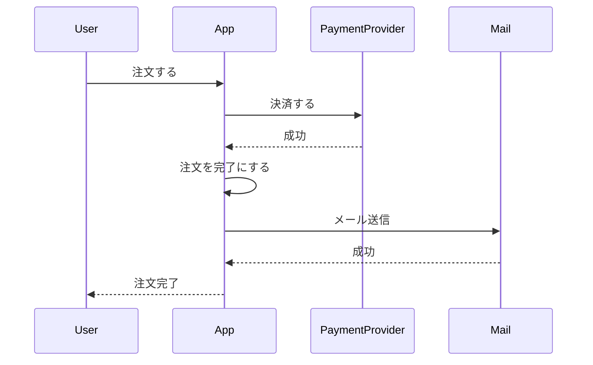

この図は、成功時の説明としては分かります。しかし、設計図としては危険です。

### なぜ危険なのか

- 決済APIがtimeoutした場合がない
- 決済成功後にDB更新失敗した場合がない
- メール失敗時の扱いがない
- Webhookによる後続通知がない
- 再試行時の冪等性がない
- duplicate webhook がない
- 外部と内部の状態差分がない

つまり、この図は「何も壊れなかった世界」しか描いていません。設計レビューで必要なのは、壊れたときにどの状態が残るかです。

## 7.8 外部連携の良いシーケンス

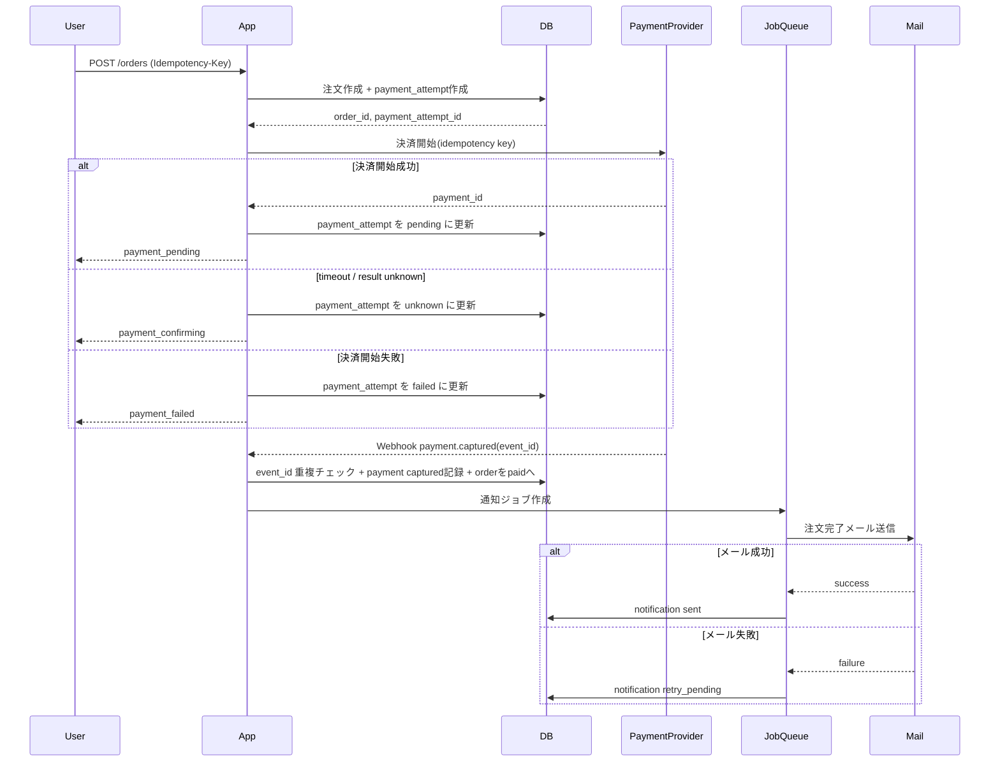

この図は、成功だけでなく、結果不明、失敗、Webhook、通知失敗を含んでいます。

### なぜこの図が良いのか

第一に、決済開始時点と決済確定時点を分けています。外部決済は即時確定とは限らないため、`payment_pending` や `payment_confirming` が必要です。

第二に、timeout を失敗扱いしていません。`unknown` として保存し、後続のWebhookや照会で確定できるようにしています。

第三に、Webhook処理で `event_id` 重複チェックをしています。これにより、duplicate webhook で二重処理しません。

第四に、メール通知を注文成立条件から分離しています。メール失敗は通知ジョブの失敗であり、注文そのものを失敗にしません。

第五に、DBに状態を保存しているため、運用者がどの注文を再試行・照会・手動復旧すべきか判断できます。

## 7.9 外部連携のレビュー問い

- timeout を失敗ではなく結果不明として扱っているか
- 外部操作に idempotency key を渡せるか
- Webhookは重複する前提で処理しているか
- Webhookの順序逆転に耐えられるか
- 外部イベントIDを一意に保存しているか
- 外部で成功、内部で失敗した場合の復旧手順があるか
- 内部で成功、外部で失敗した場合の補償処理があるか
- 状態の正が外部か内部か明確か
- reconciliation batch が必要か
- 管理画面で「結果不明」「照会中」「手動確認待ち」を表現できるか

---

# 第8章 並行処理

## 8.1 並行処理は特殊ケースではない

並行処理は、アクセス集中時だけの問題ではありません。日常的に発生します。

- ユーザーが注文ボタンを二重クリックする
- ブラウザがタイムアウト後に再送する
- スマホとPCで同時に操作する
- Webhookが重複して届く
- バッチを再実行する
- 管理者とユーザーが同時に状態を変える
- 複数ワーカーが同じジョブを処理しようとする

これらは、ユーザーが悪意を持っていなくても起きます。

並行処理を考えない設計は、「リクエストは1本ずつ順番に来る」という非現実的な前提に依存しています。

## 8.2 二重クリック

二重クリックは、最も身近な並行処理です。

悪い設計では、注文ボタンを2回押すと、2件注文が作られます。

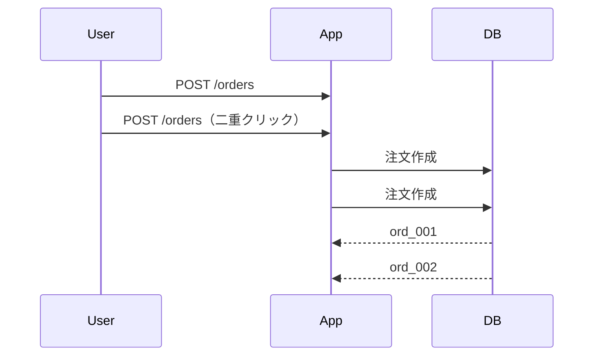

UIでボタンをdisabledにすれば防げると思うかもしれません。しかし、UIだけでは不十分です。

- ネットワーク再送がある
- JavaScriptが無効・失敗することがある
- APIを直接叩かれる可能性がある
- 複数端末から操作される可能性がある

UI対策は必要ですが、最終防衛線ではありません。

良い設計では、API側で idempotency key を使います。

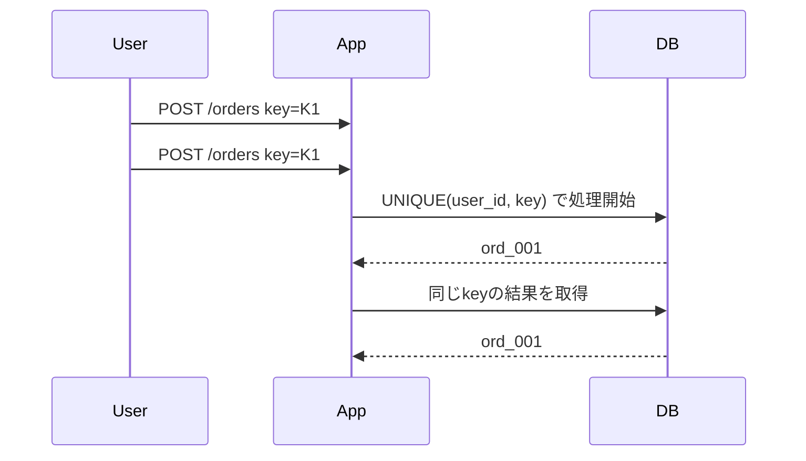

同じ業務意図に対して、同じ結果を返す。これが冪等性です。

## 8.3 同時更新

同時更新は、複数の処理が同じデータを読み、別々に更新することで起きます。

たとえば、在庫が1個だけ残っている商品を、2人が同時に購入したとします。

悪い実装:

```text
1. 在庫数を読む
2. 在庫数が1以上なら注文作成
3. 在庫数を1減らす
```

同時に実行されると、両方が在庫1を読み、両方が注文を作る可能性があります。

この問題は、アプリケーションのif文だけでは防げません。

防ぐ方法は、業務要件によって異なります。

- DBトランザクションと行ロック
- 在庫引当テーブルへのUNIQUE制約
- 楽観ロック
- 条件付きUPDATE
- キューによる直列化

重要なのは、「何を二重にしてはいけないか」を明確にすることです。

在庫であれば、「在庫数を超える引当を作ってはならない」。決済であれば、「同じ注文に対して複数の成功決済を業務反映してはならない」。返金であれば、「返金合計額が支払額を超えてはならない」。

## 8.4 webhook重複

Webhook重複は、外部連携と並行処理の交差点です。

同じWebhookが同時に2つのワーカーで処理されることがあります。

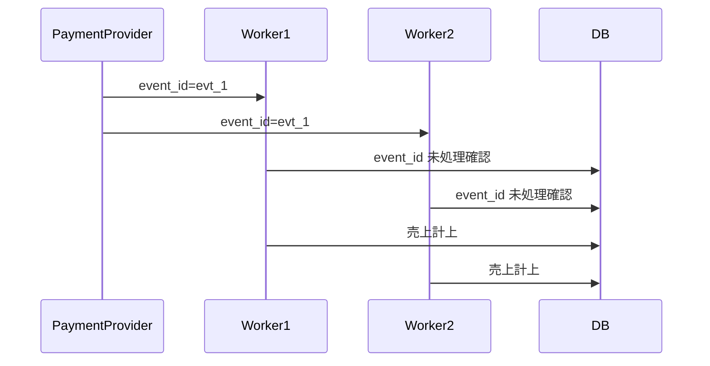

「未処理確認してから保存」では危険です。確認と保存の間に競合が起きるからです。

良い設計では、DBのUNIQUE制約で防ぎます。

```text
INSERT INTO payment_events(provider, external_event_id, ...)
ON CONFLICT DO NOTHING
```

挿入に成功したワーカーだけが業務反映を行います。挿入に失敗したワーカーは、既に処理済みまたは処理中として終了します。

## 8.5 batch再実行

バッチは再実行されます。

障害で途中停止した場合、運用者は再実行します。スケジュールの重複、デプロイ、タイムゾーン設定ミスでも再実行されることがあります。

バッチ設計で危険なのは、「一度だけ実行される」という前提です。

悪い例:

```text
毎日0時に、期限切れ注文をキャンセルし、キャンセルメールを送る
```

このバッチが2回実行されると、キャンセルメールが2通送られるかもしれません。返金処理が2回走るかもしれません。

良いバッチは、対象抽出、処理状態、冪等性を持ちます。

```text
- 対象: status = payment_pending and expires_at < now and external_success_unconfirmed
- 処理: expire_requested を作成
- 一意性: UNIQUE(order_id, operation_type)
- 再実行: 既に expire_requested がある注文はスキップ
```

バッチは「大量の業務操作を自動で実行するAPI」と考えるべきです。APIと同じく、状態条件、冪等性、監査、再試行が必要です。

## 8.6 UNIQUE制約は何を防ぐのか

UNIQUE制約は、並行処理事故の最終防衛線です。

アプリケーション側のチェックは、同時実行で破られます。DB制約は、同時実行されても一意性を守ります。

UNIQUE制約で防ぐ例:

```text
UNIQUE(order_number)
UNIQUE(user_id, idempotency_key, operation_type)
UNIQUE(provider, external_event_id)
UNIQUE(order_id, refund_request_id)
UNIQUE(order_id, shipment_instruction_type)
UNIQUE(customer_id, contract_id, valid_from)
```

ただし、UNIQUE制約は万能ではありません。何を一意にすべきかを間違えると、逆に業務を壊します。

たとえば、`UNIQUE(phone_number)` は、電話番号変更、共有番号、再割当で問題になります。一意性は業務意味に基づいて設計する必要があります。

## 8.7 optimistic lock は何を防ぐのか

楽観ロックは、同じデータを複数人が同時に編集したときの「上書き事故」を防ぎます。

例:

```text
order.version = 3
```

更新時に、クライアントが読んだ version を条件にします。

```sql
UPDATE orders
SET shipping_address = ?, version = version + 1
WHERE order_id = ? AND version = 3;
```

もし他の処理が先に更新して version が4になっていれば、この更新は失敗します。

楽観ロックが防ぐのは、「知らないうちに他人の変更を上書きする」ことです。

ただし、楽観ロックだけでは二重作成や二重Webhook処理は防げません。新規作成の重複にはUNIQUE制約、業務操作の重複には idempotency key が必要です。

## 8.8 transaction は何を防ぐのか

トランザクションは、複数のDB更新を一つの不可分な単位として扱います。

たとえば、注文状態を `paid` にし、支払い記録を作り、状態履歴を追加する。この3つは一緒に成功すべきです。

```text
BEGIN
  payment_capture 作成
  order.status = paid に更新
  order_status_history 追加
COMMIT
```

途中で失敗したら、すべて戻します。

トランザクションが防ぐのは、内部DBの部分成功です。

ただし、外部API呼び出しはDBトランザクションに含められません。トランザクション中に外部APIを呼ぶと、ロック時間が延び、timeout時の扱いも難しくなります。

良い設計では、DBトランザクションで内部事実を保存し、外部連携はジョブやイベントとして分離することが多いです。

## 8.9 並行処理対策の使い分け

| 対策 | 防ぐもの | 使う場面 | 注意点 |
|---|---|---|---|
| UNIQUE制約 | 重複作成、重複イベント | 注文番号、Webhook event_id、idempotency key | 業務上一意なものに限定する |
| idempotency key | 同じ業務操作の二重実行 | 注文作成、返金要求、外部API呼び出し | 同じキーで違う内容を拒否する |
| 楽観ロック | 上書き事故 | 管理画面編集、住所変更 | 競合時の再操作UIが必要 |
| トランザクション | DB内の部分成功 | 状態更新と履歴追加 | 外部APIを中に入れない |
| 行ロック | 同じ資源の同時変更 | 在庫引当、残高更新 | ロック範囲と時間に注意 |
| 条件付きUPDATE | 状態条件付き遷移 | `WHERE status='paid'` | 更新件数0の扱いを設計する |
| キュー直列化 | 順序制御 | 同一注文の処理順序 | 遅延と再試行を設計する |

## 8.10 並行処理のレビュー問い

- 同じ操作が2回来たら何が二重になるか
- 同じWebhookが2回来たら業務反映は一度だけか
- 同時更新で上書き事故が起きないか
- バッチ再実行で重複処理しないか
- 一意性はアプリケーションではなくDB制約で守っているか
- idempotency key の保存と一意制約があるか
- 外部APIにも冪等性キーを渡せるか
- 更新条件に現在状態を含めているか
- 更新件数0件を正常な競合として扱えるか
- トランザクション境界は外部APIを含まないように設計されているか


---

# 第9章 異常系設計

## 9.1 異常系はなぜ漏れやすいのか

異常系は、設計で最も漏れやすい領域です。

理由は複数あります。

第一に、異常系は物語になりにくいからです。正常系は「ユーザーが注文し、決済し、完了する」という一本の流れで語れます。一方、異常系は分岐、中断、再開、重複、矛盾、復旧の集合です。人間の頭は、分岐の多い構造を保持するのが苦手です。

第二に、異常系はデモで見えにくいからです。プロトタイプや画面レビューでは、外部API timeout、DB更新失敗、Webhook重複、通知失敗は通常再現されません。見えないものは、議論されにくいです。

第三に、異常系は責任境界をまたぐからです。決済失敗はアプリ、決済事業者、ネットワーク、ユーザー操作、CS対応にまたがります。誰か一人の担当領域に閉じないため、仕様として落ちやすいです。

第四に、異常系を考えると設計が複雑になるため、心理的に避けたくなるからです。「まず正常系を作ってから」と言いたくなります。しかし、異常系を後から足すと、状態、データ、API、運用がすでに異常系を表現できない形になっていることがあります。

## 9.2 異常系は try-catch ではない

異常系設計を、実装上の例外処理だと思うと危険です。

```text
try {
  決済する
  注文を完了にする
  メールを送る
} catch {
  エラーを返す
}
```

この考え方では、何が成功し、何が失敗したかが分かりません。

異常系設計で見るべきなのは、例外ではなく「残った事実」です。

- DBに注文は作られたか
- 外部決済は成功したか
- 決済成功イベントは保存されたか
- 注文状態は更新されたか
- 通知ジョブは作られたか
- 顧客に何が見えているか
- 運用者は何を調査できるか

異常系は、処理の失敗ではなく、事実の不整合として見るべきです。

## 9.3 partial success

partial success とは、処理の一部だけが成功した状態です。

Webサービスでは、partial success は頻繁に起きます。

例:

```text
DB注文作成 成功
決済API 成功
DB決済反映 失敗
メール送信 未実行
```

この状態は、「成功」でも「失敗」でもありません。外部では決済が成功していますが、自社DBでは注文が未決済のままかもしれません。

partial success を単純なエラーに押し込めると、復旧不能になります。

良い設計では、partial success を表現する状態やテーブルを持ちます。

```text
payment_attempt.status = capture_unknown
order.status = payment_confirming
recovery_task.type = reconcile_payment
```

partial success は、恥ずかしい状態ではありません。むしろ、現実を正しく表現している状態です。

## 9.4 DB成功・通知失敗

注文作成DB更新は成功したが、メール通知に失敗したケースを考えます。

悪い設計:

```text
注文作成
メール送信
メール失敗なら注文APIを失敗にする
```

この設計では、クライアントは注文が失敗したと思って再送するかもしれません。しかしDBには注文が存在します。結果として、注文重複が起きます。

良い設計:

```text
注文作成を主処理とする
通知は notification_job として作成する
メール失敗は notification_job.retry_pending にする
注文APIは注文作成成功として返す
```

メール通知が注文成立の必須条件でないなら、通知失敗で注文を失敗にしてはいけません。

ここで重要なのは、主処理と副作用を分けることです。

- 主処理: 注文という業務事実を作る
- 副作用: メール、Push通知、分析イベント、Slack通知

副作用の失敗で主処理を巻き戻すと、かえって不整合が増えます。

## 9.5 決済成功・DB失敗

これは最も危険な異常系の一つです。

```text
1. 自社システムが決済APIを呼ぶ
2. 決済事業者では決済成功
3. 自社システムがDB更新に失敗
```

この場合、外部ではお金が動いています。しかし自社DBでは注文が未決済かもしれません。

悪い設計では、APIレスポンスが500になり、ユーザーは再試行します。再試行で再度決済されると、二重決済の危険があります。

良い設計では、外部決済呼び出し前に `payment_attempt` を作成し、外部リクエストIDを保存します。

```text
1. payment_attempt を created として保存
2. 外部決済に idempotency key 付きで要求
3. 結果不明なら unknown にする
4. Webhookまたは照会で結果を確定
5. 自社注文状態を paid に遷移
```

もしDB更新に失敗しても、外部照会やWebhookから復旧できるように、外部との対応関係を保存しておく必要があります。

## 9.6 rollback と compensation

rollback は、操作をなかったことにする処理です。compensation は、取り消せない事実に対して補償する処理です。

DBトランザクション内の更新は rollback できます。しかし、決済、メール、配送指示、外部Webhook送信は、完全には rollback できないことが多いです。

たとえば、決済成功後に注文確定に失敗した場合、選択肢は次のようになります。

- 注文を復旧して paid にする
- 復旧できないなら返金する
- 顧客対応を行う
- 監査ログを残す

これは rollback ではなく compensation です。

強い設計者は、「戻す」ではなく「どの事実は戻せないか」を考えます。

## 9.7 retry の分類

retry は、すべて同じではありません。

| 種類 | 例 | 設計上の注意 |
|---|---|---|
| 安全なretry | 外部照会、メール送信再試行 | 重複しても影響が小さい、または冪等 |
| 冪等性が必要なretry | 注文作成、決済開始、返金要求 | idempotency key が必須 |
| 危険なretry | 決済確定、二重返金の可能性がある処理 | 外部状態確認なしに再実行しない |
| 手動確認後retry | 結果不明の決済、倉庫連携 | 外部照会や人間の判断が必要 |

retry の設計では、次を決めます。

- retry してよい条件
- 最大試行回数
- retry 間隔
- バックオフ
- retry 失敗後の状態
- 手動復旧対象への移行条件
- 重複実行を防ぐキー

## 9.8 異常系を漏れにくくする型

異常系を洗うには、思いつきで列挙するのではなく、型を使います。

### 型1: 境界で洗う

システム境界ごとに失敗を考えます。

- クライアント → API
- API → DB
- API → 外部決済
- 外部決済 → Webhook
- API → Queue
- Worker → 外部メール
- Batch → DB

境界では、必ず失敗、遅延、重複、順序逆転が起きます。

### 型2: 処理順序で洗う

各ステップについて、「直前で失敗」「直後で失敗」を考えます。

```text
Aの前で失敗
Aの後、Bの前で失敗
Bの後、Cの前で失敗
Cの後で失敗
```

特に、外部API呼び出しの直後は重要です。

### 型3: 事実の残り方で洗う

処理が止まったとき、何が残るかを考えます。

| 残った事実 | 危険 | 必要な設計 |
|---|---|---|
| 注文だけ作成 | 未決済注文が残る | 期限切れバッチ |
| 決済だけ成功 | 金銭事故 | 照会・復旧・返金 |
| 通知だけ失敗 | 顧客不安 | 通知再試行 |
| 状態だけ更新 | 履歴欠落 | 同一トランザクション |
| 外部イベントだけ保存 | 業務未反映 | 再処理キュー |

### 型4: 再実行で洗う

同じ処理を再実行したら何が起きるかを考えます。

- 注文が増えるか
- 決済が増えるか
- 返金が増えるか
- メールが増えるか
- 状態履歴が重複するか
- 売上計上が重複するか

### 型5: 時間差で洗う

時間差によって起きる問題を考えます。

- Webhookが遅れて届く
- キャンセル後に決済成功が届く
- 期限切れ後に入金される
- 商品価格変更後に注文確定される
- 権限変更直後に古いセッションで操作される

## 9.9 異常系マトリクス例

| 処理 | 失敗箇所 | 残る事実 | ユーザー表示 | 復旧方法 | 再試行可否 |
|---|---|---|---|---|---|
| 注文作成 | DB保存前 | なし | 注文失敗 | 再操作 | 可 |
| 注文作成 | DB保存後レスポンス前 | 注文あり | 不明 | idempotency key で同じ注文を返す | 可 |
| 決済開始 | 外部timeout | payment_attemptあり、外部不明 | 確認中 | 外部照会/Webhook待ち | 条件付き |
| 決済確定 | Webhook重複 | event重複 | 変化なし | event_idで無視 | 可 |
| 通知 | メール失敗 | 注文成功、通知未送信 | 注文成功 | 通知再試行 | 可 |
| 返金 | 外部成功DB失敗 | 外部返金済み、内部未反映 | 確認中 | 外部照会で反映 | 危険 |

このような表を作ると、異常系が実装前に見えるようになります。

## 9.10 異常系設計のレビュー問い

- try-catch ではなく、残る事実で考えているか
- partial success を表現する状態があるか
- 外部成功・内部失敗の復旧方法があるか
- 内部成功・外部失敗の補償方法があるか
- 通知失敗を主処理失敗にしていないか
- timeout を結果不明として扱っているか
- retry 可能、retry 危険、手動確認必要を分類しているか
- 再実行で何が重複するか洗っているか
- 異常状態を運用画面やバッチで抽出できるか
- 異常系テストが設計されているか

---

# 第10章 禁止系設計

## 10.1 禁止系設計とは何か

禁止系設計とは、「何を許すと世界が壊れるか」を明確にする設計です。

多くの要件定義は、許可を中心に書かれます。

```text
ユーザーは注文できる
管理者は注文をキャンセルできる
CSは返金できる
```

しかし、システム事故の多くは「許してはいけないことを許した」ことで起きます。

```text
支払い前に発送できてしまった
発送済みなのにキャンセルできてしまった
返金額が支払額を超えた
退会済みユーザーの個人情報を表示してしまった
同じWebhookを2回売上反映した
```

禁止系設計は、システムの防波堤です。

## 10.2 壊してはいけない条件

禁止事項を書く前に、「壊してはいけない条件」を明確にします。

例:

```text
金銭:
- 売上は二重計上されてはならない
- 返金額は支払額を超えてはならない
- 決済成功済みの注文を未決済として失効させてはならない

在庫:
- 在庫数を超えて引当してはならない
- キャンセル済み注文に在庫を保持し続けてはならない

配送:
- 支払い未確定の注文を発送してはならない
- キャンセル済み注文を発送してはならない

個人情報:
- 権限のない担当者が個人情報を閲覧してはならない
- 退会・削除要求後の表示ルールを破ってはならない

履歴:
- 過去注文金額を現在の商品価格で上書きしてはならない
- 状態変更理由を監査不能にしてはならない
```

禁止系設計は、業務領域ごとに「壊れるもの」を分けると洗いやすくなります。

## 10.3 「何を許すと世界が壊れるか」

禁止事項の価値は、事故を防ぐ具体性にあります。

弱い禁止事項:

```text
不正な操作は禁止する
誤った状態変更は禁止する
権限のない操作は禁止する
```

これはほとんど意味がありません。何が不正か、何が誤りかが分からないからです。

強い禁止事項:

```text
paid 以外の注文に shipment_instruction を作成してはならない
canceled/refunded の注文に対して payment_capture を新規作成してはならない
refund_total_amount + new_refund_amount > captured_amount となる返金要求を作成してはならない
user_id が一致しない注文に対して、顧客ユーザーは cancel API を実行してはならない
同一 external_event_id の payment.captured を複数回売上反映してはならない
```

強い禁止事項は、実装、DB制約、テストに変換できます。

## 10.4 どこまで禁止事項を書くべきか

すべての否定文を書く必要はありません。

たとえば、「猫は注文できない」「火星人はログインできない」のような、業務上現実的でなく、設計判断にも影響しない禁止事項を書く必要はありません。

禁止事項として書くべきなのは、次の条件です。

- 実際に起きうる
- 起きると業務事故になる
- 実装者が誤解しやすい
- 状態や権限によって可否が変わる
- 外部連携や並行処理で発生しやすい
- テスト観点に落とす価値がある
- DB制約やAPI制約として実装できる

逆に、書かなくてよいものは次です。

- 業務上起きえない、または影響がない
- 既に上位の不変条件に含まれている
- 実装やテストに変換できない抽象的な注意
- 単なる要件文の機械的な否定

## 10.5 要件の単純な裏返しが弱い理由

要件:

```text
管理者は注文をキャンセルできる
```

弱い禁止事項:

```text
一般ユーザーは管理者キャンセルできない
```

これは必要ではありますが、設計上の事故を十分に防ぎません。

本当に考えるべき禁止事項は、状態や副作用に関するものです。

```text
発送済み注文をキャンセル状態にしてはならない。返品フローへ進める。
返金処理なしに paid 注文を canceled にしてはならない。
倉庫停止確認なしに preparing_shipment を canceled にしてはならない。
キャンセル済み注文に対して発送指示を作成してはならない。
```

単純な裏返しは、権限の表面だけを見ています。強い禁止事項は、業務の破綻点を見ています。

## 10.6 禁止事項とDB制約

禁止事項は、可能な限りシステムの制約に落とすべきです。

例:

```text
同じ外部イベントを二重処理してはならない
→ UNIQUE(provider, external_event_id)

同じidempotency keyで注文を複数作ってはならない
→ UNIQUE(user_id, operation_type, idempotency_key)

返金額が支払額を超えてはならない
→ アプリケーション制約 + トランザクション + 集計ロック

状態遷移は許可されたものに限る
→ 状態遷移関数 + 状態遷移表 + テスト
```

すべてをDB制約だけで守ることはできません。しかし、DB制約で守れるものをアプリケーションだけに任せるのは危険です。

## 10.7 禁止系設計のレビュー問い

- 「壊してはいけない条件」が業務領域ごとに書かれているか
- 禁止事項は抽象的な注意ではなく、実装・テスト可能な形か
- 要件の単純な裏返しだけになっていないか
- 状態依存の禁止が書かれているか
- 権限依存の禁止が書かれているか
- 外部連携、並行処理、再実行による禁止破りを考えているか
- 禁止事項をDB制約、API制約、状態遷移、テストへ落とせるか
- 管理者機能やバッチが禁止事項の抜け穴になっていないか

---

# 第11章 影響範囲分析

## 11.1 影響範囲分析の本質

影響範囲分析で重要なのは、「何を変えるか」ではなく、「何の前提が壊れるか」です。

弱い影響範囲分析は、変更箇所を探します。

```text
この機能追加では orders テーブルと注文APIを変更する
```

強い影響範囲分析は、前提の崩れを探します。

```text
これまで注文は即時決済だけだったが、後払いを追加することで、paid 前に注文が長期間存在するようになる。
そのため、キャンセル、在庫引当、期限切れ、管理画面表示、売上集計、督促通知、発送条件、CS対応の前提が変わる。
```

影響範囲漏れは、多くの場合、変更対象のファイルや画面だけを見て、周辺の業務前提を見ないことで起きます。

## 11.2 データ意味変更による影響

データ意味変更は、影響範囲分析で最も見落とされやすい領域です。

例:

```text
user.phone_number を、本人確認済み電話番号から、連絡先電話番号に変更する
```

この変更は、一見するとユーザープロフィール画面の変更に見えます。しかし、実際には大きな影響があります。

- SMS認証に使っていたか
- ログインIDに使っていたか
- 注文連絡先に使っていたか
- CS検索キーに使っていたか
- 不正検知に使っていたか
- ユニーク制約があるか
- 外部CRMへ同期しているか
- 過去データの意味はどうなるか
- API利用者は何の意味で使っているか

データ意味変更では、カラム名だけでなく、そのカラムを読むすべての場所の業務意味を確認する必要があります。

## 11.3 CRUD × 関係者 × 時系列

影響範囲を洗う強力な型が、CRUD × 関係者 × 時系列です。

### CRUD

対象データについて、作成、参照、更新、削除それぞれの影響を見ます。

| 操作 | 見るべきこと |
|---|---|
| Create | 誰が作るか、初期状態、必須項目、一意性 |
| Read | 誰が見るか、現在値か過去値か、権限、マスキング |
| Update | 誰が変えるか、履歴、状態条件、監査 |
| Delete | 物理削除か論理削除か、参照整合、法務保持 |

### 関係者

同じデータでも、関係者によって意味が違います。

- 顧客
- 管理者
- CS
- 倉庫担当者
- 経理
- マーケティング
- 外部連携先
- バッチ
- 監査担当

### 時系列

時間によって前提が変わります。

- 作成前
- 作成直後
- 処理中
- 確定後
- キャンセル後
- 返金後
- 退会後
- 数年後の監査時

この3軸で考えると、影響範囲漏れが減ります。

## 11.4 直接影響と間接影響

直接影響は、変更対象に明示的に関係する部分です。

例:

```text
注文キャンセル仕様を変える
→ キャンセルAPI、注文状態、キャンセル画面を変更
```

間接影響は、その変更によって前提が変わる部分です。

```text
キャンセル可能期間を発送準備前まで延長する
→ 倉庫連携停止が必要
→ 返金タイミングが変わる
→ 売上集計の計上タイミングが変わる
→ CSの問い合わせテンプレートが変わる
→ キャンセルメール文面が変わる
→ 不正検知中注文の扱いが変わる
```

影響範囲漏れは、多くの場合、間接影響で起きます。

## 11.5 なぜ影響範囲漏れが起きるのか

影響範囲漏れが起きる理由は、設計者が「変更するもの」を中心に考えるからです。

たとえば、後払い決済を追加する場合、弱い設計者は決済手段の追加として考えます。

```text
payment_method に postpay を追加する
```

しかし、強い設計者は前提変更として考えます。

```text
これまでは注文時に支払いが確定していた。
後払いでは、商品発送後または請求後に支払いが発生する。
つまり、paid ではないが発送可能な注文が存在するかもしれない。
この場合、『支払い確定前に発送してはならない』という既存不変条件を見直す必要がある。
```

前提が壊れると、状態設計、発送条件、売上計上、督促、与信、キャンセル、返金、会計が影響を受けます。

## 11.6 強い人はどう洗っているのか

強い設計者は、変更点から周辺へ広げるだけでなく、不変条件から逆向きに確認します。

```text
今回の変更で、既存の不変条件は破られないか？
既存の状態遷移に新しい分岐が必要か？
現在値参照で過去データが壊れないか？
既存APIの意味が変わらないか？
既存バッチの対象条件に入ってしまわないか？
管理画面の表示分類は変わらないか？
売上集計の定義は変わらないか？
CSの検索・対応手順は変わらないか？
```

強い人は、変更対象のコードだけでなく、壊れる前提を探します。

## 11.7 影響範囲分析の例：後払い決済追加

### 弱い分析

```text
- 決済手段に後払いを追加する
- 決済APIを追加する
- 注文画面に後払い選択肢を出す
```

これは表面的です。

### 強い分析

```text
前提変更:
- これまで注文は決済成功後に発送可能だった
- 後払いでは、支払い確定前に発送可能にするかもしれない
- paid の意味が「発送許可」と一致しなくなる可能性がある

状態:
- payment_pending と shipment_allowed を分ける必要があるか
- postpay_authorized の状態が必要か
- 未払い督促状態が必要か

データ:
- 支払い期限
- 請求書番号
- 与信結果
- 督促履歴
- 入金確認履歴

API:
- 後払い与信API
- 入金Webhook
- 督促通知API

外部連携:
- 与信結果遅延
- 入金Webhook重複
- 請求取消

並行処理:
- キャンセルと入金Webhookが同時に来る
- 督促バッチと入金反映が同時に走る

異常系:
- 与信成功・注文作成失敗
- 発送後に与信取消
- 入金成功・DB反映失敗

運用:
- 未払い一覧
- 手動入金消込
- 督促停止
- 返金ではなく過入金対応

テスト:
- 未払い状態で発送可否
- 支払期限切れ
- 入金Webhook重複
- キャンセル後入金
```

この分析では、単に画面とAPIを追加するのではなく、既存の業務前提がどのように変わるかを見ています。

## 11.8 影響範囲分析のレビュー問い

- 変更対象ではなく、壊れる前提を列挙しているか
- 既存の不変条件が破られないか確認したか
- データの意味が変わるカラムはないか
- CRUDそれぞれで影響を見たか
- 関係者ごとの影響を見たか
- 時系列で前後関係を見たか
- 直接影響と間接影響を分けたか
- 既存バッチ、集計、管理画面、通知、外部連携に影響がないか
- 過去データを現在ルールで誤解しないか
- 影響範囲をテスト観点に変換したか

---

# 第12章 認知負荷と設計

## 12.1 設計漏れは頭が悪いから起きるのではない

設計漏れは、個人の能力不足だけで起きるものではありません。

Webサービス設計は、そもそも人間の頭だけで扱うには複雑です。業務ルール、状態、データ、認可、API、外部連携、並行処理、異常系、運用、テストを同時に考える必要があります。

人間のワーキングメモリには限界があります。多くの要素を頭の中だけで保持しようとすると、無意識に情報を落とします。

落とされやすいのは、目に見えないものです。

- 禁止事項
- 途中状態
- 外部連携失敗
- 過去データ
- 運用復旧
- 監査ログ
- 再試行
- 重複
- 権限差

これらは、画面や正常系ほど目立ちません。だから漏れます。

## 12.2 ワーキングメモリ不足で何が起きるか

ワーキングメモリが不足すると、人間は次のような単純化をします。

### 単純化1: 正常系だけを見る

「注文して決済して完了」という一本道だけを見ます。異常系、重複、途中停止が落ちます。

### 単純化2: 現在だけを見る

現在の画面表示や現在のDB値だけを見ます。過去履歴、将来変更、監査時点が落ちます。

### 単純化3: ひとりの主体だけを見る

ユーザー操作だけを見ます。管理者、CS、バッチ、Webhook、外部システムが落ちます。

### 単純化4: 直列処理だけを見る

処理が順番に実行されると思います。同時更新、二重クリック、再送が落ちます。

### 単純化5: 成功/失敗の二値で見る

成功か失敗かだけを見ます。結果不明、partial success、復旧待ちが落ちます。

これらは、意志の弱さではなく、認知負荷への自然な反応です。だから、仕組みで補う必要があります。

## 12.3 設計を外部化する必要性

設計を外部化するとは、頭の中の前提、判断、未決事項、状態、制約を、紙面や図や表に出すことです。

外部化には、3つの効果があります。

第一に、忘れにくくなります。頭の中に保持しなくてよいため、他の観点を考える余裕ができます。

第二に、矛盾が見えます。図や表にすると、`paid -> canceled` の副作用が抜けている、`pending` の意味が曖昧、同じカラムが複数の意味を持つ、といった矛盾が見えるようになります。

第三に、他者がレビューできます。頭の中にある設計はレビューできません。外部化された設計だけが、チームの共有物になります。

## 12.4 設計書の本質は思考の外部メモリである

設計書は、成果物として保存するためだけの文書ではありません。

設計書の本質は、思考の外部メモリです。

良い設計書は、次のような働きをします。

- 何を考えたかを残す
- 何を考えていないかを見える化する
- どの前提で判断したかを残す
- 未決事項を忘れないようにする
- レビュー時に同じ対象を見られるようにする
- 将来の変更時に、どの前提を壊してはいけないかを示す

逆に、悪い設計書は、決定済みの結果だけを書きます。

```text
注文APIを作る
ordersテーブルを作る
statusカラムを追加する
```

これでは、なぜその設計なのか、何を禁止しているのか、何が未検討なのかが分かりません。

## 12.5 TODO が重要な理由

TODOは、設計の弱さではありません。むしろ、強い設計者ほどTODOを明確にします。

なぜなら、未決事項を頭の中に残すと漏れるからです。

良いTODO:

```text
TODO: payment_pending から expired にする前に、外部決済照会が必要か確認する
TODO: refund_requested 中に発送確定Webhookが来た場合の優先順位を決める
TODO: 退会済みユーザーの過去注文表示で、氏名を保持するかマスクするか法務確認
TODO: 後払い追加時、paid と shipment_allowed の分離が必要か検討
```

悪いTODO:

```text
TODO: あとで考える
TODO: エラー対応
TODO: 管理画面
```

良いTODOは、問いの形をしています。何を決めればよいかが明確です。

## 12.6 状態遷移表が重要な理由

状態遷移表は、認知負荷を下げる強力な道具です。

頭の中で「この状態ではこの操作ができて、この場合は副作用があり、ここでは禁止」と考えるのは難しいです。しかし、表にすると見えます。

| 現在状態 | 操作 | 主体 | 次状態 | 条件 | 副作用 | 監査 |
|---|---|---|---|---|---|---|
| paid | cancel | user | refund_requested | 発送準備前 | refund_request作成 | 必須 |
| paid | cancel | cs | refund_requested | 理由必須 | refund_request作成 | 必須 |
| shipped | cancel | user | - | 不可 | 返品案内 | - |

表にすると、空欄が目立ちます。空欄は、考慮漏れの候補です。

## 12.7 強い人ほどメモが多い理由

強い設計者は、頭の中で全部覚えている人ではありません。

強い設計者は、覚えなくてよいように外に出す人です。

メモが多い人は、思考が散らかっているのではありません。複雑な対象を、頭の外に配置して扱っているのです。

設計レビューで強い人は、よく次のようなメモを作ります。

- 不変条件リスト
- 状態遷移表
- 禁止遷移リスト
- 異常系マトリクス
- 外部連携の結果不明ケース
- idempotency key の対象操作
- データ履歴が必要な値
- 影響範囲メモ
- 未決事項
- テスト観点

これは、思考の品質を上げるための道具です。

## 12.8 認知負荷を下げる設計書テンプレート

```text
1. この機能が守る不変条件
2. 対象エンティティと状態
3. 状態遷移表
4. 禁止事項
5. データ保存方針
   - 現在値
   - 履歴
   - スナップショット
   - 一意性
6. 操作主体と認可
7. API一覧
8. 外部連携
   - timeout
   - retry
   - duplicate
   - source of truth
9. 並行処理
10. 異常系マトリクス
11. 運用・復旧
12. テスト観点
13. 未決事項
```

このテンプレートの価値は、すべてを完璧に書くことではありません。考えるべき箱を先に作ることです。

箱があると、空欄が見えます。空欄が見えると、漏れを議論できます。

## 12.9 認知負荷のレビュー問い

- 設計の前提は頭の中ではなく文書化されているか
- 状態、禁止事項、異常系が図表化されているか
- 未決事項がTODOとして具体的に書かれているか
- 空欄が見えるテンプレートになっているか
- 一人の暗黙知に依存していないか
- レビュー担当者が同じ設計対象を見られるか
- 将来の変更者が「なぜそうしたか」を読めるか
- 設計書が思考の外部メモリとして機能しているか

---

# 第13章 シーケンス図

## 13.1 シーケンス図の役割

シーケンス図は、処理の時間順序と責任境界を表す図です。

良いシーケンス図は、次を明らかにします。

- 誰が誰を呼ぶか
- どこで状態が保存されるか
- 外部境界はどこか
- どの処理が同期で、どの処理が非同期か
- どこで失敗すると partial success になるか
- retry と重複がどこで起きるか
- どの処理が業務成立条件で、どの処理が副作用か

悪いシーケンス図は、単なる成功ストーリーになります。

## 13.2 悪いシーケンス図

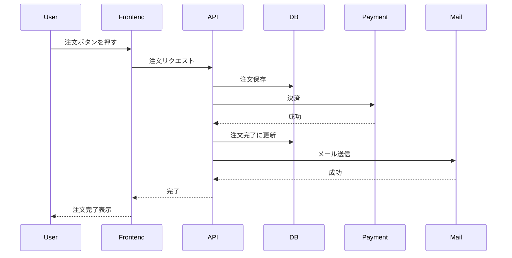

### なぜこの図は危険なのか

この図は、成功時の順序だけを描いています。設計レビューで本当に見たいものが見えません。

- DB保存後、決済前に失敗したらどうなるか
- 決済成功後、DB更新に失敗したらどうなるか
- メール送信に失敗したら注文は失敗なのか
- ユーザーが同じリクエストを再送したらどうなるか
- 決済Webhookがあるのか、同期レスポンスだけで確定するのか
- 決済API timeout は失敗か結果不明か
- 注文完了の定義は、決済成功かメール成功か

この図は、partial success を隠します。特に危険なのは、外部決済とDB更新の境界です。外部決済が成功した後にDB更新が失敗すると、金銭事実と注文状態が不一致になります。しかし、この図ではその状態を表現できません。

## 13.3 良いシーケンス図

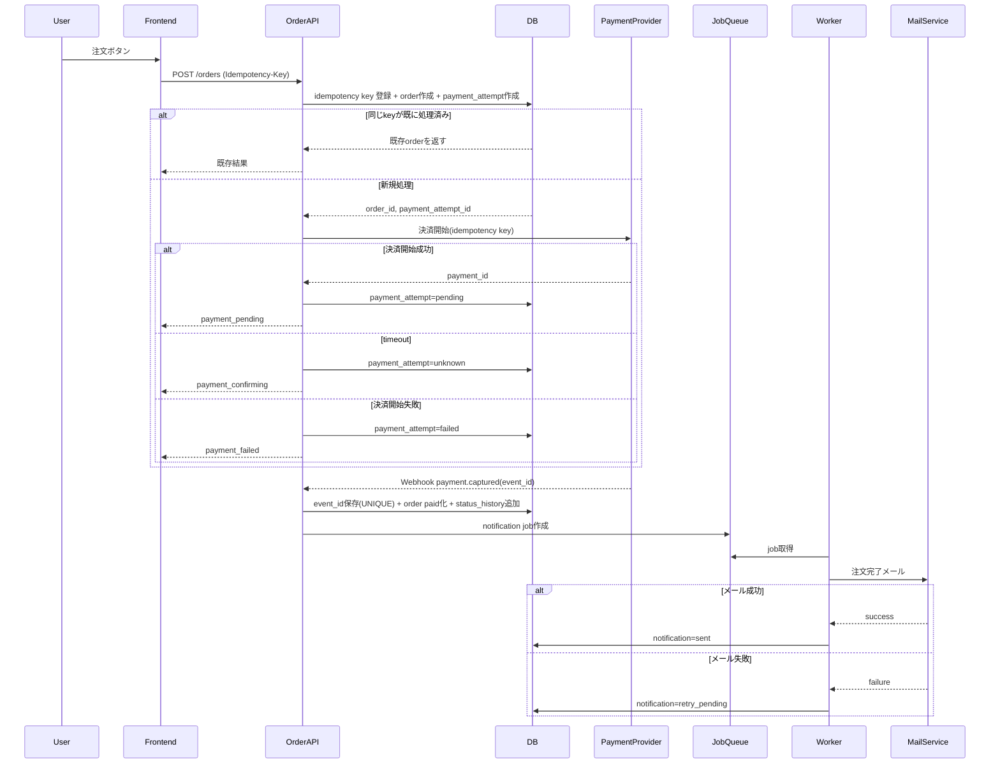

### なぜこの図が良いのか

第一に、idempotency key が最初に出てきます。これにより、二重クリックや再送が業務重複にならないことが分かります。

第二に、注文作成と決済開始を分けています。決済開始前に `payment_attempt` を保存することで、外部決済との対応関係を追えます。

第三に、timeout を結果不明として扱っています。これにより、外部で成功したかもしれない処理を単純失敗として再実行しません。

第四に、決済確定はWebhookで反映しています。外部イベントIDを保存し、重複処理を防いでいます。

第五に、メール通知をジョブ化しています。メール失敗で注文成立を壊さず、通知だけ再試行できます。

第六に、状態保存のタイミングが見えます。どこでDBに事実を残すかが明確なので、障害時に復旧可能です。

## 13.4 良いシーケンス図を書くための原則

### 原則1: 外部境界を明示する

外部API、メール、キュー、Webhook、バッチは境界です。境界では失敗します。境界を図に出すと、失敗箇所が見えます。

### 原則2: DB保存を省略しない

シーケンス図で `DB` を省略すると、どの事実が保存されるか分からなくなります。状態保存のタイミングは、復旧可能性を決めます。

### 原則3: alt で失敗と結果不明を書く

成功だけでなく、失敗、timeout、重複を `alt` で書きます。

### 原則4: 同期と非同期を分ける

注文APIの中で完了する処理と、ジョブやWebhookで後続処理するものを分けます。

### 原則5: 副作用を主処理に混ぜない

メール、分析イベント、通知は副作用です。主処理の成立条件かどうかを明確にします。

## 13.5 シーケンス図で partial success を見つける方法

シーケンス図を描いたら、各矢印の直後に処理が止まった場合を考えます。

```text
API -> DB: 注文保存
この直後に落ちたら？

API -> Payment: 決済開始
この直後にtimeoutしたら？

Payment -> API: 成功レスポンス
この直後にDB更新失敗したら？

API -> Queue: 通知ジョブ作成
この直前に落ちたら？
```

外部境界の直後、DB更新の直前、キュー投入の直前は、partial success が発生しやすい場所です。

## 13.6 シーケンス図のレビュー問い

- 成功系だけでなく、失敗、timeout、重複が描かれているか
- 外部境界が明示されているか
- DBにどの事実をいつ保存するか描かれているか
- partial success が起きる箇所が見えるか
- 主処理と副作用が分かれているか
- 同期処理と非同期処理が分かれているか
- retry 可能な箇所に冪等性があるか
- Webhook重複時の処理が描かれているか
- 図を見てテスト観点が出せるか

---

# 第14章 テスト観点

## 14.1 テスト観点を書くと設計漏れが見える理由

テスト観点は、実装後の確認作業だけではありません。設計の曖昧さを発見する道具です。

設計が曖昧な箇所は、テストケースにしようとすると詰まります。

例:

```text
payment_pending の注文はキャンセルできるか？
```

この問いに答えられないなら、キャンセルルールが未設計です。

```text
決済Webhookが2回来たら、2回目はどうなるか？
```

この問いに答えられないなら、Webhook冪等性が未設計です。

```text
注文作成後、メール送信に失敗したらAPIは成功か失敗か？
```

この問いに答えられないなら、主処理と副作用の境界が未設計です。

テスト観点は、設計の穴を照らします。

## 14.2 強い設計者のテスト観点の出し方

強い設計者は、画面操作のテストだけを出しません。次の軸で出します。

- 業務ルール
- 状態遷移
- 禁止遷移
- 認可
- データ履歴
- 一意性
- 外部連携
- 並行処理
- 異常系
- 運用復旧

### 状態遷移からテストを出す

状態遷移表の各行は、テストケースになります。

```text
paid の注文に対して cancel を実行すると refund_requested になる
shipped の注文に対して cancel を実行すると拒否される
payment_pending の注文が期限切れになる前に外部照会される
```

### 禁止事項からテストを出す

禁止事項は、負のテストケースになります。

```text
未決済注文に発送指示を作成できない
返金額が支払額を超える返金要求を作成できない
同じ external_event_id を2回処理しても売上は1回だけ
```

### 異常系からテストを出す

異常系マトリクスの各行もテストになります。

```text
決済API timeout 時、payment_attempt は unknown になる
メール送信失敗時、注文は paid のままで notification が retry_pending になる
DB更新失敗後、Webhook再処理で復旧できる
```

## 14.3 テストしづらい設計はなぜ危険なのか

テストしづらい設計は、多くの場合、責任や状態が曖昧です。

例:

```text
PUT /orders/{id} で何でも更新する
```

このAPIはテストしづらいです。なぜなら、どのフィールド変更がどの業務操作なのか分からないからです。キャンセル、配送先変更、管理者メモ更新、発送状態更新が混ざると、テストケースが組み合わせ爆発します。

別の例:

```text
status = pending
```

`pending` が何を意味するか曖昧だと、テスト期待値を書けません。

テストしづらさは、設計の臭いです。

もちろん、すべてを簡単にテストできるわけではありません。しかし、業務上重要な不変条件や状態遷移がテストできないなら、設計が危険です。

## 14.4 良いテスト観点表

| 観点 | テスト内容 | 期待結果 | 設計に戻す問い |
|---|---|---|---|
| 状態遷移 | payment_pending に決済成功Webhook | paidへ遷移 | event_id重複は？ |
| 禁止遷移 | canceled に発送指示 | 拒否 | 管理者でも拒否？ |
| 冪等性 | 同じ注文作成keyを2回送る | 同じorder_id | リクエスト内容違いは？ |
| 外部timeout | 決済開始timeout | unknown状態 | 照会バッチは？ |
| partial success | 注文成功・メール失敗 | 注文成功、通知retry | ユーザー表示は？ |
| 認可 | 他人の注文キャンセル | 403 | 管理者権限は？ |
| 履歴 | 商品価格変更後に過去注文表示 | 注文時価格 | snapshot保存は？ |
| 並行処理 | 在庫1に同時注文2件 | 1件成功 | DB制約/ロックは？ |
| 運用 | unknown決済を手動復旧 | 監査ログあり | 理由必須か？ |

この表の価値は、テストだけでなく、設計に戻す問いが含まれていることです。

## 14.5 悪いテスト観点

```text
- 注文できること
- キャンセルできること
- メールが届くこと
- 管理者画面で見えること
```

これは正常系の確認に偏っています。

悪い理由は、壊してはいけない条件を確認していないことです。

- 注文が二重にならないこと
- 支払い前に発送できないこと
- 発送済みはキャンセルできないこと
- 決済Webhook重複で二重売上にならないこと
- メール失敗で注文が消えないこと
- 過去注文金額が商品価格変更で変わらないこと

良いテスト観点は、事故を防ぐ条件から出ます。

## 14.6 テスト観点のレビュー問い

- 業務ルール、不変条件からテストを出しているか
- 状態遷移表の各行をテストできるか
- 禁止遷移のテストがあるか
- 認可の負のテストがあるか
- 外部timeout、重複Webhook、順序逆転のテストがあるか
- partial success のテストがあるか
- 並行処理のテストがあるか
- 履歴・現在値のテストがあるか
- 運用復旧のテストがあるか
- テストしづらい箇所を設計の問題として扱っているか

---

# 第15章 運用設計

## 15.1 「動く」だけでは足りない

システムは、リリース後に初めて現実にさらされます。

実装時には想定していなかった操作、外部連携の遅延、Webhook重複、データ不整合、問い合わせ、手動復旧、監査対応が発生します。

「正常に動く」だけのシステムは、障害時に運用できません。

運用できないシステムは危険です。なぜなら、問題が起きたときに、何が起きているか分からず、どう直せばよいか分からず、直した結果が監査できないからです。

運用設計とは、問題が起きたときに人間が安全に介入できるようにする設計です。

## 15.2 audit

audit とは、誰が、いつ、何を、なぜ行ったかを追跡できるようにすることです。

監査ログが必要な操作:

- 状態変更
- 返金
- キャンセル
- 個人情報閲覧
- 手動復旧
- 権限変更
- 外部連携再実行
- データ訂正

監査ログには、少なくとも次を含めます。

```text
actor_type: user/admin/system/batch/webhook
actor_id
operation_type
target_type
target_id
before_value
after_value
reason_code
request_id
occurred_at
```

監査ログがないと、障害対応後に「誰が何をしたか」が分からなくなります。特に手動復旧では、監査ログがなければ復旧作業自体が新たなリスクになります。

## 15.3 retry 運用

retry は自動化すれば終わりではありません。

retry には運用設計が必要です。

- retry 対象一覧を見られるか
- retry 回数を見られるか
- 最後の失敗理由を見られるか
- 次回retry予定時刻を見られるか
- 手動retryできるか
- retry停止できるか
- retryしてはいけない状態に変わったら止まるか

たとえば、返金retry中に注文が別フローで解決済みになった場合、古いretryが走って二重返金してはいけません。retryジョブは、実行時に現在状態を再確認する必要があります。

## 15.4 manual recovery

手動復旧は、設計段階で考えるべきです。

「障害が起きたらエンジニアがDBを直す」は、運用設計ではありません。

手動復旧で必要なもの:

- 復旧対象を検索できる
- 現在状態と関連外部状態を確認できる
- 可能な復旧操作が限定されている
- 操作前に影響が表示される
- 理由入力が必須
- 承認が必要な操作は承認される
- 操作結果が監査ログに残る
- 復旧後に後続ジョブを再開できる

管理者に任意SQLを実行させるのではなく、安全な復旧操作として設計するべきです。

## 15.5 ログ

ログは、障害時の記憶です。

良いログは、調査に必要な文脈を持っています。

```text
request_id
user_id
order_id
payment_attempt_id
external_payment_id
external_event_id
idempotency_key
operation_type
state_before
state_after
error_code
```

悪いログ:

```text
error occurred
payment failed
failed to update
```

これでは調査できません。

ログの目的は、エラーが起きたことを知らせるだけではなく、どの業務事実がどの状態で止まったかを調べられるようにすることです。

## 15.6 調査可能性

調査可能性とは、問題発生後に、原因と影響範囲を追える性質です。

調査可能性が低いシステムでは、問い合わせ対応が属人的になります。

例:

```text
お客様: 決済したのに注文が完了していません
```

調査に必要な情報:

- 注文ID
- 決済試行ID
- 外部決済ID
- Webhook受信履歴
- payment_attempt の状態
- order_status_history
- 通知履歴
- request_id
- idempotency key
- 手動復旧履歴

これらがつながっていれば、調査できます。つながっていなければ、ログをgrepし、人間の勘に頼ることになります。

## 15.7 rollback と運用

運用における rollback は、コードのリリース rollback だけではありません。業務状態の復旧も含みます。

たとえば、新しいキャンセル仕様をリリースした後、誤って発送済み注文をキャンセル可能にしてしまったとします。

必要なのは、コードを戻すだけではありません。

- 影響を受けた注文を抽出する
- 誤ってキャンセルされた注文を分類する
- 返金が発生したか確認する
- 倉庫指示が止まったか確認する
- 顧客通知が送られたか確認する
- 手動補正する
- 監査ログを残す

運用設計では、障害時に「どのデータをどう戻すか」まで考える必要があります。

## 15.8 運用できないシステムが危険な理由

運用できないシステムは、障害が起きたときに復旧判断ができません。

結果として、次のような危険が生まれます。

- 復旧作業でさらにデータを壊す
- 顧客対応で誤案内する
- 金銭事故を見逃す
- 再発防止ができない
- 監査や法務対応ができない
- エンジニア個人の暗黙知に依存する

システムは、正常時より異常時に設計品質が現れます。

## 15.9 運用設計のレビュー問い

- 異常状態を一覧で抽出できるか
- retry 対象、失敗理由、試行回数を確認できるか
- 手動復旧操作は安全に制限されているか
- 手動復旧に理由、実行者、変更前後が残るか
- 外部状態と内部状態を照合できるか
- request_id、order_id、external_event_id でログを追えるか
- 通知失敗、Webhook未処理、結果不明決済を監視できるか
- 障害時の影響範囲を抽出できるか
- コードrollback後のデータ補正手順があるか
- CSや運用担当が状況を理解できる表示があるか

---

# 第16章 過剰設計との境界

## 16.1 すべてを完璧に設計しなくてもよい

ここまで多くの観点を述べてきました。しかし、すべての機能に、完璧な状態遷移、履歴、監査、復旧、冪等性、外部照合を作るべきだという意味ではありません。

過剰設計は、実装速度を落とし、理解を難しくし、変更コストを上げます。

重要なのは、考慮を省くことではなく、リスクを理解したうえで、今どこまで作るかを決めることです。

強い設計者は、すべてを作る人ではありません。何を今作り、何を明示的に後回しにし、何を絶対に落としてはいけないかを判断する人です。

## 16.2 どこまで考慮すべきか

考慮すべき深さは、次の要素で決まります。

- 金銭が絡むか
- 個人情報が絡むか
- 外部連携があるか
- 不可逆操作があるか
- 後から履歴復元が必要か
- 並行実行が起きやすいか
- 障害時の影響が大きいか
- 手動復旧が必要か
- 法務・監査要件があるか
- 将来変更の可能性が高いか

金銭、個人情報、不可逆操作、外部連携がある場合、初期段階でも最低限の安全設計が必要です。

逆に、社内向けの低リスクな表示設定機能であれば、最初から重厚な状態管理や監査を作る必要はないかもしれません。

## 16.3 MVP段階で最低限やるべきこと

MVPでは、すべてを作り込む必要はありません。しかし、後から取り返せないものは最初に考えるべきです。

MVPでも落としてはいけないもの:

```text
- 永続識別子を変わる値にしない
- 金銭・外部イベントの重複処理を防ぐ
- 注文時点など過去事実のスナップショットを保存する
- 状態名に複数意味を詰め込みすぎない
- 最低限の監査ログを残す
- 手動復旧が必要な状態を抽出できる
- 外部timeoutを失敗扱いで握りつぶさない
```

MVPで後回しにしやすいもの:

```text
- 完全な管理画面
- 高度な自動復旧
- 詳細な分析用履歴
- 複雑な承認ワークフロー
- すべての通知チャネル対応
```

ただし、後回しにする場合も、後で追加できる余地を残す必要があります。

たとえば、最初は手動復旧画面を作らなくても、復旧対象を判別できる状態とログは必要です。最初は詳細な分析をしなくても、注文時点の金額スナップショットは必要です。

## 16.4 今必要な複雑さと未来の複雑さ

設計には、2種類の複雑さがあります。

第一に、今必要な複雑さです。これは、現在の業務リスクを正しく扱うために必要なものです。決済の冪等性、Webhook重複排除、注文金額スナップショットなどは、金銭を扱うなら今必要です。

第二に、未来の複雑さです。これは、将来あるかもしれない仕様のためのものです。まだ存在しない複雑なキャンペーン、国際税制、多段承認、複数倉庫などを、最初から全部作る必要はないかもしれません。

過剰設計は、未来の複雑さを今実装しすぎることで起きます。

しかし、設計不足は、今必要な複雑さを無視することで起きます。

境界を見極めるには、次の問いが有効です。

```text
この考慮を今しないと、後から過去データを復元できなくなるか？
この考慮を今しないと、金銭・個人情報・法務事故が起きるか？
この考慮を今しないと、外部連携失敗時に復旧不能になるか？
この考慮を今実装しなくても、後から安全に追加できるか？
```

## 16.5 過剰設計の悪い例

```text
まだ注文数が少なく、決済手段も1つだけなのに、20種類の注文状態、複雑な承認ワークフロー、多段イベントソーシング、汎用ルールエンジンを導入する
```

これは危険です。

なぜなら、現実の業務がまだ固まっていない段階で抽象化しすぎると、抽象化が外れるからです。外れた抽象化は、単純な実装よりも修正が難しいです。

過剰設計は、チームの認知負荷も上げます。誰も理解できない状態機械、汎用化しすぎたAPI、使われない履歴テーブルは、バグの温床になります。

## 16.6 設計不足の悪い例

```text
MVPだから、注文状態は pending/done だけ
MVPだから、決済Webhook重複は考えない
MVPだから、注文時点の金額は保存しない
MVPだから、電話番号をユーザーIDにする
```

これは危険です。

MVPであっても、後から復元できない事実を捨ててはいけません。注文時点の金額、外部イベントID、永続識別子、最低限の状態は、後から正確に作ることが困難です。

MVPとは、安全性を捨てることではありません。価値検証に不要な機能を削ることです。

## 16.7 良いMVP設計

良いMVP設計は、将来のすべてを作りません。しかし、後から取り返せないものは守ります。

例:

```text
- 注文状態は最小限だが、payment_pending / paid / canceled / failed は分ける
- 注文時点の商品名、単価、税、送料はsnapshotする
- 決済Webhook event_id は一意保存する
- idempotency key で注文重複を防ぐ
- 詳細な管理画面はないが、復旧対象をSQLで安全に抽出できる状態を持つ
- 通知は単純だが、通知失敗で注文を失敗にしない
- 手動復旧は限定的だが、監査ログは残す
```

これは、過剰ではありません。金銭と履歴と外部連携を扱うための最低限です。

## 16.8 過剰設計との境界を決めるレビュー問い

- この機能は金銭、個人情報、外部連携、不可逆操作を含むか
- このデータは後から復元できるか
- この考慮を後回しにした場合、どんな事故が起きるか
- 後回しにすることを明示的に記録しているか
- 今作る複雑さは、現在のリスクに見合っているか
- 未来の仮説だけで複雑化していないか
- MVPで削るのは機能か、安全性か
- 後から追加できる余地を残しているか
- チームが理解・運用できる複雑さか

---

# 終章 設計レビューで使う統合チェックリスト

ここまでの内容を、設計レビューで使える形にまとめます。

## A. 業務ルール

- 不変条件は書かれているか
- 禁止事項は書かれているか
- 状態依存ルールは書かれているか
- 要件の単純な裏返しではなく、事故を防ぐ禁止事項になっているか
- そのルールからテストを作れるか

## B. 状態

- 状態名は業務事実を表しているか
- pending/done に複数の意味を詰め込んでいないか
- 途中状態、失敗状態、復旧待ち状態があるか
- 誰が状態変更するか明確か
- 禁止遷移が書かれているか
- 状態遷移表に条件、副作用、監査があるか

## C. データ

- 現在値と過去事実を分けているか
- 変わる値をキーにしていないか
- 電話番号、メール、住所、商品名、価格を識別子にしていないか
- 注文時点・契約時点の値を復元できるか
- 一意性はDB制約で守っているか
- 状態履歴と監査ログがあるか

## D. 認可

- 操作主体ごとの許可が明確か
- 状態ごとに認可が変わるか
- 管理者機能が禁止遷移の抜け穴になっていないか
- 個人情報閲覧や手動復旧に監査ログがあるか

## E. API

- CRUDではなく業務操作として設計しているか
- 状態変更APIに前提状態と遷移先があるか
- idempotency key が必要な操作にあるか
- partial success をレスポンスや状態で表現できるか
- retry 可否が設計されているか

## F. 外部連携

- timeout を結果不明として扱っているか
- duplicate webhook に耐えるか
- Webhook順序逆転に耐えるか
- 状態の正をどこに置くか決まっているか
- 外部成功・内部失敗の復旧があるか
- reconciliation が必要か

## G. 並行処理

- 二重クリックで重複しないか
- 同時更新で上書きしないか
- Webhook重複で二重処理しないか
- バッチ再実行で二重処理しないか
- UNIQUE制約、idempotency key、楽観ロック、transaction を適切に使っているか

## H. 異常系

- partial success を洗っているか
- DB成功・通知失敗の扱いが決まっているか
- 決済成功・DB失敗の扱いが決まっているか
- rollback ではなく compensation が必要な箇所を把握しているか
- retry、手動確認、復旧不能を分類しているか

## I. 影響範囲

- 変更対象ではなく、壊れる前提を見ているか
- データ意味変更がないか
- CRUD × 関係者 × 時系列で洗ったか
- 直接影響と間接影響を分けたか
- 既存バッチ、集計、通知、管理画面、CS対応に影響がないか

## J. 認知負荷

- 設計は図表で外部化されているか
- 空欄や未決事項が見えるか
- TODOは具体的な問いになっているか
- 一人の暗黙知に依存していないか

## K. シーケンス図

- 成功系だけでなく失敗系が描かれているか
- DB保存のタイミングが描かれているか
- 外部境界が見えるか
- partial success の箇所が見えるか
- 主処理と副作用が分かれているか

## L. テスト

- 不変条件からテストを出しているか
- 禁止遷移のテストがあるか
- 外部連携失敗、Webhook重複、retry のテストがあるか
- 並行処理のテストがあるか
- テストしづらい設計を放置していないか

## M. 運用

- 異常状態を抽出できるか
- retry 状態を見られるか
- 手動復旧が安全にできるか
- audit log があるか
- request_id、external_event_id、order_id で追跡できるか
- 障害時に影響範囲を出せるか

## N. 過剰設計

- 今必要な安全性と未来の仮説を分けているか
- MVPで後から復元不能な事実を捨てていないか
- チームが理解できる複雑さか
- 後回しにするリスクを明示しているか

---

# 付録1 設計レビュー用テンプレート

```markdown
# 機能名

## 1. 目的
この機能は何の業務価値を提供するか。

## 2. 不変条件
- 

## 3. 禁止事項
- 

## 4. 対象エンティティ
- 

## 5. 状態設計

### 状態一覧
| 状態 | 意味 | 主な待ち対象 | 終了状態か |
|---|---|---|---|

### 状態遷移表
| 現在状態 | 操作 | 主体 | 次状態 | 条件 | 副作用 | 禁止理由/監査 |
|---|---|---|---|---|---|---|

## 6. データ設計

### 現在値
- 

### 履歴
- 

### スナップショット
- 

### 一意性
- 

## 7. 認可
| 操作 | 主体 | 条件 | 監査 |
|---|---|---|---|

## 8. API
| API | 業務操作 | 冪等性 | 前提状態 | 結果状態 |
|---|---|---|---|---|

## 9. 外部連携
| 連携先 | 操作 | timeout時 | retry | 重複 | 状態の正 |
|---|---|---|---|---|---|

## 10. 並行処理
- 二重クリック:
- 同時更新:
- Webhook重複:
- バッチ再実行:

## 11. 異常系マトリクス
| 処理 | 失敗箇所 | 残る事実 | 復旧方法 | 再試行可否 |
|---|---|---|---|---|

## 12. 運用
- retry:
- manual recovery:
- audit:
- ログ:
- 監視:

## 13. テスト観点
- 

## 14. 未決事項
- TODO:
```

---

# 付録2 よくある危険な言葉

設計レビューで次の言葉が出てきたら、注意して深掘りします。

## pending

何を待っているのか確認します。

## done

何が完了したのか確認します。

## 失敗したら戻す

本当に戻せるのか確認します。外部決済、メール、配送指示は戻せない可能性があります。

## あとで考える

何を決めればよいのかTODOにします。

## 管理者なら変更できる

禁止遷移を破れないか、監査ログがあるか確認します。

## 一旦エラーにする

残る事実は何か、再送で二重にならないか確認します。

## リトライする

冪等性があるか、retryしてはいけない操作ではないか確認します。

## 現在の値を参照する

過去事実が必要ではないか確認します。

## 外部が成功したら

timeout、重複、順序逆転、結果不明を確認します。

## MVPだから

後から復元不能な事実を捨てていないか確認します。

---

# 付録3 最後に覚えておくべき原則

## 原則1: 正常系は設計の入口であり、出口ではない

正常系は必要です。しかし、正常系だけでは設計は完成しません。壊れ方を見て初めて設計は強くなります。

## 原則2: 状態は業務事実の要約である

状態名は、業務判断に使える意味を持つべきです。`pending` や `done` に逃げないこと。

## 原則3: 変わる値を識別子にしない

電話番号、メール、住所、商品名、価格、組織名は変わります。識別子には意味を持たない永続IDを使います。

## 原則4: 外部timeoutは失敗ではなく不明である

結果不明を失敗扱いすると、二重実行や金銭事故が起きます。

## 原則5: retry するなら冪等性を設計する

再試行は自然に起きます。二重実行されても壊れない設計にします。

## 原則6: 禁止事項は事故から逆算する

要件の裏返しではなく、何を許すと世界が壊れるかを書きます。

## 原則7: 設計書は思考の外部メモリである

設計書は、答えを書く場所であると同時に、考えるべきことを忘れないための道具です。

## 原則8: テストしづらい設計は危険信号である

テスト観点に落とせない設計は、状態や責任が曖昧な可能性があります。

## 原則9: 運用できないシステムは安全ではない

障害時に調査・復旧・監査できないシステムは、正常時に動いていても危険です。

## 原則10: MVPでも後から復元不能な事実は捨てない

簡素化してよいものと、最初から守るべきものを分けます。

---

# おわりに

設計考慮漏れをなくすために必要なのは、すべてのケースを暗記することではありません。

必要なのは、壊れ方から逆算する思考順序です。

業務ルールを見て、不変条件を置く。状態を分解し、途中状態と禁止遷移を明示する。データを現在値と過去事実に分ける。APIをCRUDではなく業務操作として設計する。外部連携は結果不明、重複、遅延を前提にする。並行処理は通常発生するものとして制約で防ぐ。異常系は try-catch ではなく、残る事実で考える。運用、テスト、影響範囲まで含めて、設計を思考の外部メモリとして残す。

強い設計とは、複雑にすることではありません。現実に存在する複雑さを、隠さず、扱える形に分解することです。

そして、良い設計レビューとは、誰かを責める場ではありません。人間が自然に漏らしてしまうものを、図、表、問い、制約、テストによってチームで発見する場です。

設計考慮漏れは、才能だけで防ぐものではありません。型で防ぐものです。

この教科書の問いを、設計書の横に置いてください。

「何ができるか」ではなく、「何を許すと世界が壊れるか」。

その問いから始めるだけで、設計の強さは大きく変わります。
